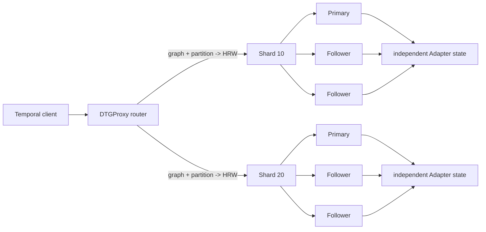

# DTGProxy deployment modes

Status: implemented routing and deterministic acceptance runtime; production control plane is not yet complete.

DTGProxy exposes two user-facing deployment modes over one Shard/Raft/temporal kernel. “Primary/Replica” describes how copies of one Shard coordinate. “Shared-Nothing” describes how the graph is partitioned and resources are owned. They are not competing consensus algorithms: every Shared-Nothing Shard can itself be a Primary/Replica group.

## PrimaryReplica

- One logical Shard owns the graph scope selected for this deployment.
- The Raft leader is the Primary and acknowledges writes only after quorum commit and its local Adapter apply.
- `CURRENT` and other linearizable reads require the current leader plus a quorum `ReadIndex` barrier.
- Followers may serve `AS OF` and `DIFF` only when placement epoch, leader term, applied index, and closed timestamp all validate.
- This mode is the compatibility path for a user migrating from one centralized graph/SQL instance. It can use RF=1 for development or RF=3+ for availability.

## SharedNothing

- There are two or more independently owned Shards; each has its own placement epoch, Raft log, Adapter state, snapshot generation, safe time, and failure domain.
- `(graph_id, logical_partition_id)` is mapped to one physical Shard by seeded highest-random-weight (rendezvous) hashing.
- Shard IDs are arbitrary and do not need to equal logical partition IDs.
- Adding a Shard either leaves a partition on its old Shard or moves it to the new Shard; it does not reshuffle a key between two existing Shards.
- Point plans route to one Shard. Global scans and graph frontiers fan out only to required Shards and merge canonical ordered results.
- Cross-Shard writes use the current TSO + Intent + 2PC protocol. Constraint-owner probes, epoch-fenced participant intents, durable Home decisions, and idempotent finalization preserve atomicity; an unresolved outcome remains recoverable rather than being exposed as a partial commit.

## Frozen routing contract

The Rust API is implemented in `crates/dtgproxy/src/lib.rs`:

- `DeploymentConfig::primary_replica`
- `DeploymentConfig::shared_nothing`
- `route_scope` and `route_plan`
- `InProcessDeploymentRuntime`

The route seed, sorted Shard IDs, and placement epochs are control-plane state. A request carries the selected epoch. Migration changes the epoch and old requests fail closed rather than writing through stale routing.

The acceptance tests prove:

1. both modes materialize the same independent Multi-Raft core;
2. HRW routing is deterministic and minimizes movement on Shard addition;
3. a logical partition whose ID differs from its physical Shard can be written and read;
4. leader `CURRENT` and follower `AS OF` return identical typed temporal data after the required barriers.

## Remaining production work

- Meta Raft persistence for placements, seeds, epochs, and Adapter profiles;
- online rebalancing with snapshot + WAL suffix handoff;
- distributed transaction coordination for atomic cross-Shard edges and secondary indexes;
- persistent pooled/multiplexed transport, admission control, TLS, authentication, metrics, and rolling upgrade tests;
- topology-aware placement across fault domains.
