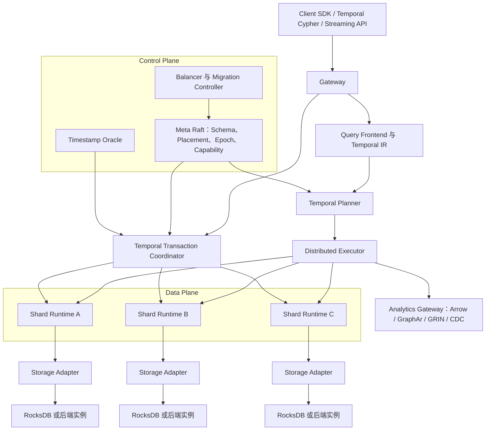
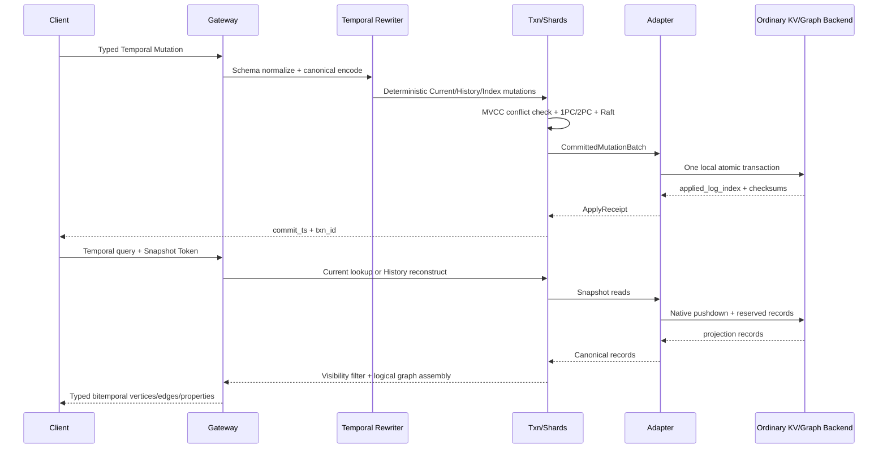
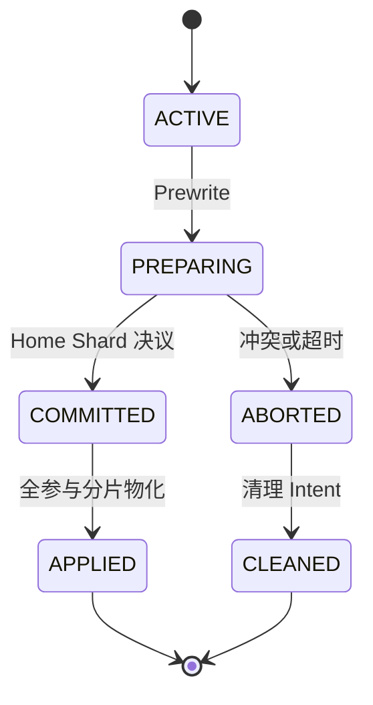

# 分布式双时态图中间件详细设计方案

文档状态：设计评审稿  
日期：2026-07-17  
目标实现语言：Rust 核心 + 语言无关 Adapter Sidecar  
工作名称：DTGProxy（Distributed Temporal Graph Middleware）

## 1. 执行摘要

DTGProxy 是位于应用和普通 KV/图数据库之间的分布式双时态属性图中间件。它向应用提供统一的时态图模型、查询接口、事务、分片、复制、查询执行和分析接口；向下通过 Storage Adapter SPI 接入 RocksDB、Neo4j、NebulaGraph、TigerGraph、Galaxybase 或其他满足能力契约的后端。

系统的核心定位不是“再造一个只支持 RocksDB 的图数据库”，也不是“把查询简单广播到多个数据库”，而是：

> 在不要求底层数据库原生支持双时态和跨实例事务的情况下，由中间件统一提供分布式双时态语义，并将确定性的普通图/KV 变更投影到用户选择的后端。

系统采用以下核心方案：

- 数据模型：属性图 + 有效时间（valid time）+ 事务时间（transaction time）。
- 分布方式：Shared-Nothing、多 Shard Group、每组 Raft 复制。
- 事务方式：双时态 MVCC + 全局 Timestamp Oracle + Percolator 风格乐观 2PC。
- 查询方式：时态图 IR、能力感知下推、分布式分片执行与流式归并。
- 存储方式：Current Projection + History Projection；历史采用版本目录和 anchor+delta 压缩。
- 分片方式：顶点 Home Shard + 出入邻接双投影 + 高度点邻接桶化。
- 适配方式：RocksDB 进程内参考适配器；其他数据库使用进程外 Sidecar。
- 分析方式：一致快照 + 增量变更流 + Arrow/GraphAr/GRIN 接口。
- 实现方式：Rust 单一核心，C/C++ 仅经稳定 ABI 接入，Java/Go 仅用于必须使用官方驱动的 Sidecar。

## 2. 已冻结的设计决策

| 编号 | 决策 |
|---|---|
| D-01 | 首版只支持属性图，不支持 RDF/SPARQL。 |
| D-02 | 逻辑模型从第一天支持 valid time 与 transaction time。 |
| D-03 | 同一个逻辑图的一次部署统一使用一种后端类型，不允许不同分片混用不同数据库。 |
| D-04 | 中间件拥有分片、事务时间、跨分片原子性和查询归并语义。 |
| D-05 | 首批参考后端为 RocksDB 与 Neo4j；其他后端通过同一 SPI 后续加入。 |
| D-06 | 默认隔离级别为 Temporal Snapshot Isolation；提供可选 Temporal Serializable。 |
| D-07 | 当前图与历史图必须在同一个逻辑事务中更新。 |
| D-08 | 跨分片边同时维护源点出邻接和目标点入邻接。 |
| D-09 | Rust 是唯一核心语言；后端官方驱动可封装为语言无关 Sidecar。 |
| D-10 | 首版不实现完整 GQL/Cypher，而实现稳定的 Temporal IR、事务 API 和必要的 Temporal Cypher 子集。 |
| D-11 | 首版采用中间件管理的 Shard Replica；由底层数据库接管复制属于后续能力。 |
| D-12 | 所有公开的性能数字都是待验证工程目标，不在实测前作为产品承诺。 |

## 3. 目标、非目标与成功条件

### 3.1 目标

1. 将输入的双时态属性图无损映射到普通 KV 或普通属性图数据库。
2. 从任意一致事务快照读回时，重建语义等价的双时态图。
3. 在多个集中式后端实例之上提供透明分片和横向扩展。
4. 保证点、边、属性版本、双邻接和索引的跨分片原子性。
5. 支持当前查询、历史快照、有效时间区间、审计、差分和时间路径查询。
6. 同时支持在线事务查询和一致快照上的全图/增量分析。
7. 通过能力协商将过滤、扫描、邻接扩展和聚合尽量下推到后端。
8. 允许新增后端时只实现 Adapter SPI 和合约测试，不修改事务与查询核心。

### 3.2 非目标

- 首版不在同一逻辑图内混用 RocksDB、Neo4j 等异构后端。
- 首版不提供跨地域低延迟写入；先保证单地域多可用区一致性。
- 首版不实现任意长度正则路径的全部 GQL 语义。
- 首版不允许应用绕过中间件直接写底层数据库；直写会破坏事务时间和历史完整性。
- 首版不把最终一致后端包装成严格 ACID 后端。
- 首版不为大型全图导入提供单个超大 2PC 事务，而使用独立的 Bulk Epoch 协议。
- 首版不把机器学习 Temporal Graph Benchmark 当作数据库事务基准；机器学习基准仅用于后续分析接口验证。

### 3.3 成功条件

- 语义：模型检查、适配器合约测试和故障测试中不存在原子性、快照一致性或历史丢失错误。
- 兼容：同一份逻辑数据和查询在 RocksDB、Neo4j 后端得到一致结果。
- 扩展：以局部分片负载为主时，增加数据节点能显著提高吞吐，且无中心查询节点饱和。
- 开销：单分片当前图查询相对直接后端访问的中间件增量保持可解释、可测量。
- 恢复：任意单节点故障不会造成已确认事务丢失；过期 Intent 可自动 roll forward 或 rollback。
- 可运维：可观测分片、事务、Raft、Adapter、版本重建和跨分片通信的关键指标。

## 4. 现有系统设计思想及其边界

### 4.1 分布式图数据库

NebulaGraph 将图存储接口转换为 KV 操作，下面依次是 Multi Group Raft 和本地存储引擎；这一分层验证了“图语义、共识、本地 KV”可以解耦。其公开仓库为 Apache-2.0，但 `KVStore`、`raftex`、Folly、Thrift 与自身元数据类型耦合较深，因此 DTGProxy 借鉴分层和测试，核心不直接复制整套实现。[NebulaGraph 存储架构](https://docs.nebula-graph.io/3.8.0/1.introduction/3.nebula-graph-architecture/4.storage-service/) [NebulaGraph 源码](https://github.com/vesoft-inc/nebula)

TigerGraph 的分布式查询模式让计算沿每一跳遍历分布到持有源点数据的机器，再在一个节点归并结果；这说明图查询不能只做传统数据库的静态分库路由，还要支持 frontier 驱动的跨机执行。其数据库内核并未公开，能复用的是公开算法、客户端和接口，不是存储/事务代码。[TigerGraph 分布式查询](https://docs.tigergraph.com/gsql-ref/4.2/querying/distributed-query-mode) [TigerGraph 公开仓库](https://github.com/orgs/tigergraph/repositories)

Galaxybase 的公开产品架构包含接口、计算、分布式查询和原生分布式存储层，但公开资料不足以独立核验其分片、共识和事务细节。因此设计调研中将厂商声明与可复现机制分开记录。[Galaxybase 产品架构](https://www.galaxybase.com/galaxyproduct)

JanusGraph 展示了可插拔存储后端的价值，也展示了其风险：事务能力受底层后端影响，在 Cassandra/HBase 等后端上通常不能自然获得可串行化和多行原子写。DTGProxy 因而不能把“后端可插拔”等同于“事务能力自动可移植”，而必须把事务、Intent 和提交决议放在统一中间件层。[JanusGraph 架构](https://docs.janusgraph.org/master/getting-started/architecture/) [JanusGraph 事务](https://docs.janusgraph.org/v0.3/basics/transactions/)

### 4.2 图分析系统

GraphScope 的 GRIN 用 C 接口抽象遍历、属性读取、过滤、edge-cut、vertex-cut 和 master/mirror 能力，将 M 个存储与 N 个计算引擎的集成从 M×N 降为 M+N。GRIN 是只读接口，适合作为 DTGProxy Analytics SPI 的基础，但事务写入和双时态选择必须由 DTGProxy 扩展。[GRIN 文档](https://graphscope.io/docs/storage_engine/grin) [GRIN 源码](https://github.com/GraphScope/GRIN)

GraphScope Groot 是基于 RocksDB 的分布式多版本持久图存储，使用 snapshot ID 提供快照读取；它证明多版本图与 RocksDB 结合可行，但 snapshot ID 主要表达系统版本，不等同于用户有效时间与系统事务时间的完整双时态语义。[Groot 架构](https://graphscope.io/docs/storage_engine/groot)

PowerGraph 指出自然图的幂律度分布会使简单 vertex-cut/edge-cut 方案出现负载或通信问题，并通过 GAS 与 vertex-cut 处理超级节点。DTGProxy 不照搬 GAS 作为事务模型，但采用“稳定 Home Vertex + 可拆分邻接桶 + master/mirror 元数据”处理高度点。[PowerGraph](https://www.usenix.org/conference/osdi12/technical-sessions/presentation/gonzalez)

### 4.3 数据库中间件与分布式事务

Vitess 的 VTGate 负责协议兼容、分片路由和结果合并，ShardingSphere 采用可插拔特性架构；DTGProxy 吸收其网关、路由、改写、执行、归并和插件化边界，但将路由单元从表/行提升为点、边、邻接、版本区间和图算子。[Vitess VTGate](https://vitess.io/docs/archive/19.0/concepts/vtgate/) [ShardingSphere 架构](https://shardingsphere.apache.org/document/current/en/reference/architecture/)

Percolator/TiKV 使用开始时间戳、Prewrite、Primary/Secondary Lock 和提交时间戳实现乐观 2PC；Spanner 使用复制组保护参与分片并用 2PC 协调跨组事务；CockroachDB 使用 MVCC、Intent、事务记录和并行提交。这些构成 DTGProxy 事务层的主要基础。[Percolator](https://research.google/pubs/large-scale-incremental-processing-using-distributed-transactions-and-notifications/) [TiKV Percolator](https://tikv.org/deep-dive/distributed-transaction/percolator/) [Spanner](https://research.google/pubs/spanner-googles-globally-distributed-database-2/) [CockroachDB Transaction Layer](https://www.cockroachlabs.com/docs/stable/architecture/transaction-layer/)

Weaver 和 G-Tran 说明图事务的读写集大、访问随机、冲突率高，通用事务协议需要针对邻接局部性、批量 frontier 和图约束优化。DTGProxy 首版不依赖 RDMA，但在分片、批量 RPC 和冲突键设计中吸收这些结论。[Weaver](https://www.vldb.org/pvldb/vol9/p852-dubey.pdf) [G-Tran](https://www.vldb.org/pvldb/vol15/p2545-chen.pdf)

### 4.4 时态图系统

AeonG 采用当前存储与历史存储分离，并用 anchor+delta 降低历史存储和版本重建成本；TPGM+/GRADOOP 将 valid time 与 transaction time 应用于点、边、属性和图集合。DTGProxy 继承双时态语义和历史压缩思想，但研究创新目标不是“首次提出双时态图”，而是后端无关的分布式双时态事务与执行中间件。[AeonG](https://www.vldb.org/pvldb/vol17/p1515-lu.pdf) [TPGM+](https://dbs.uni-leipzig.de/files/research/publications/2021-11/pdf/Rost_2021_Bitemporal%20Property%20Graphs%20to%20Organize.pdf) [GRADOOP](https://doi.org/10.1007/s00778-021-00667-4)

## 5. 系统不变量

以下不变量优先级高于性能优化：

1. **全局事务时间不变量**：`transaction time` 只能由线性一致 Timestamp Oracle 分配，用户和后端本地时钟无权修改。
2. **双时态唯一不变量**：给定 `(logical_id, valid_ts, tx_ts)`，同类存在事实或属性值至多可见一个。
3. **快照不变量**：一个事务的所有分片读取使用同一个 `start_ts` 和 `schema_version`。
4. **原子边不变量**：一条边的身份、版本、出邻接、入邻接和相关索引全部提交或全部不提交。
5. **时态引用不变量**：严格模式下，边有效区间包含于两端点共同存在区间。
6. **历史不可伪造不变量**：用户可回溯修正 valid time，但不能回写 transaction time；历史关闭通过系统提交产生。
7. **确定性应用不变量**：Raft 日志包含完全展开的逻辑 Mutation；状态机 Apply 不访问系统时间和外部随机源。
8. **幂等不变量**：同一 `(txn_id, mutation_seq)` 重放任意次数结果相同。
9. **适配器原子不变量**：后端数据变更与 `applied_log_index` 必须在同一个本地原子批次提交。
10. **路由 Epoch 不变量**：事务只能在其固定的分片 Epoch 上提交；Epoch 改变时事务重试。
11. **快照封闭不变量**：Shard 只能对外宣告 `safe_ts` 之前的快照；该水位不得越过未物化的已提交写入或可在该时间前提交的未决 Intent。

## 6. 逻辑架构



### 6.1 Gateway

- 无状态，可横向扩容。
- 负责认证、会话、协议解码、请求限流和查询取消。
- 维护 Meta Cache，但不成为数据路由的唯一中心。
- 每个请求携带 `graph_id`、`schema_version`、`partition_epoch`、`request_id`。

### 6.2 Control Plane

- 3 或 5 个 Meta 节点组成独立 Raft Group。
- 保存租户、图、Schema、Adapter Profile、Shard Placement、Replica、节点健康和迁移 Epoch。
- Timestamp Oracle 首版与 Meta 服务同部署但使用独立状态机；吞吐成为瓶颈后可拆分。
- Balancer 只生成计划，具体迁移由源/目标 Shard Runtime 执行。

### 6.3 Shard Runtime

- 一个数据节点托管多个 Shard Group Replica。
- 每个 Shard Group 是独立 Raft Group，拥有事务 Intent、版本元数据、安全时间和 Adapter。
- Leader 处理线性一致读写；Follower 可在 `safe_ts` 允许时服务历史/只读查询。
- 所有 Replica 按相同日志顺序将确定性 Mutation 应用到各自后端分片。

### 6.4 Storage Adapter

- RocksDB Adapter 与 Shard Runtime 进程内运行。
- 图数据库 Adapter 默认使用 Sidecar，避免驱动崩溃、GC 或依赖冲突破坏核心进程。
- Adapter 不决定事务提交；它只验证局部能力、读取本地数据、原子应用已提交 Mutation、生成检查点。

### 6.5 Analytics Gateway

- 在固定 `snapshot_ts` 上导出一致图快照。
- 将邻接和属性转为 Arrow RecordBatch 或 GraphAr。
- 提供 GRIN 只读桥接和按 `commit_ts` 排序的增量变更流。
- 分析查询不能持有无限长事务；超过租约后必须续租或重新固定快照。

## 7. 部署模型

### 7.1 最小开发部署

- 1 个进程内 Meta/TSO。
- 1 个数据节点。
- 多个逻辑 Shard，复制因子 1。
- RocksDB 或单个后端实例。

该模式只用于开发，不具备高可用承诺。

### 7.2 标准生产部署

- 3 个 Meta/TSO 节点。
- 至少 3 个数据节点。
- 每个 Shard Group 默认 3 Replica，跨故障域分布。
- Gateway 至少 2 个实例。
- 每个 Shard Replica 绑定本地 RocksDB，或绑定本节点的后端数据库实例/命名空间。

### 7.3 两种后端复制模式

**Managed Replica（首版）**：每个 Raft Replica 有独立后端状态，所有副本按 Raft 日志应用。适用于 RocksDB，也适用于用多个集中式图数据库实例构成分片副本。

**Delegated Replica（后续）**：底层后端自身提供线性一致复制和故障转移，中间件只维护跨分片事务记录。该模式会产生双层一致性和故障归因问题，首版不启用。

## 8. 双时态数据模型

### 8.1 时间域

系统定义两个正交时间域：

- `valid_time`：事实在业务世界成立的时间，由应用提供。
- `transaction_time`：事实版本在 DTGProxy 中可见的时间，由系统提交产生。

所有区间采用左闭右开形式 `[from, to)`，上界可为 `+∞`。外部时间统一规范化为 UTC 微秒；业务需要离散序号时由应用先映射为整数时间域。

### 8.2 全局时间戳

```text
HybridTimestamp {
  physical_micros: i64,
  logical: u32
}
```

比较按 `(physical_micros, logical)` 字典序进行。TSO Leader 先在稳定存储中预留高水位，再从内存顺序发号；事务协调器不能获得可乱序使用的独立时间戳段。这样既可批量持久化高水位，又保持对外分配顺序。

### 8.3 身份、存在与属性

逻辑身份与时态存在分离：

```text
VertexIdentity(graph_id, vertex_id, label_id, user_key)
EdgeIdentity(graph_id, edge_id, edge_type_id, src_id, dst_id)
```

端点属于 EdgeIdentity，修改端点等价于删除旧边并创建新边。

时态事实分为：

```text
ExistenceVersion {
  element_id,
  valid: [vf, vt),
  transaction: [tf, tt),
  op: PRESENT | ABSENT,
  commit_id
}

PropertyVersion {
  element_id,
  property_id,
  value,
  valid: [vf, vt),
  transaction: [tf, tt),
  commit_id
}
```

逻辑层允许属性独立拥有双时态区间。物理层可以将同一提交中的多个属性变化合并为 Element Delta，以降低记录数。

### 8.4 可见性

版本 `x` 在查询 `(valid_ts, read_ts)` 下可见，当且仅当：

```text
x.valid_from <= valid_ts < x.valid_to
AND
x.tx_from <= read_ts < x.tx_to
```

点或边还必须有可见的 `PRESENT` 存在版本。属性版本的有效区间必须位于其元素存在区间内。

### 8.5 回溯修正与区间拆分

若当前认知为：

```text
A: valid=[1,10), tx=[100,+∞)
```

事务在 `commit_ts=200` 将 `[4,7)` 修正为 B，则提交产生：

```text
Close(A, tx_to=200)
Open(A, valid=[1,4), tx=[200,+∞))
Open(B, valid=[4,7), tx=[200,+∞))
Open(A, valid=[7,10), tx=[200,+∞))
```

`Close` 是存储无关逻辑 Mutation。RocksDB 历史层可追加 Closure Delta，普通图数据库可在本地事务内更新旧版本的 `tx_to`。两种物理表示必须产生相同可见性。

### 8.6 时态约束

- 同一元素的存在版本在任意 `(valid_ts, tx_ts)` 至多一个为 PRESENT。
- 同一元素同一属性在任意 `(valid_ts, tx_ts)` 至多一个值可见。
- 边存在区间必须包含于源、目标顶点共同存在区间；首版冲突时拒绝，不自动裁剪。
- 用户唯一键可声明 `CURRENT_UNIQUE` 或 `VALID_TIME_UNIQUE`。
- 内置引用完整性不依赖 Snapshot Isolation 下的普通读验证。边变更对两个 `EndpointGuard(vertex_id)` 获取可共存的 S Intent，端点删除获取 X Intent；二者互斥而多个边事务可并发。首版使用顶点级 Guard 优先保证正确性，后续才在等价性测试下细化为 valid-interval Guard。
- 删除是写入 ABSENT/Closure，不是立即物理删除。
- transaction time 只能前进；不提供用户自定义 `tx_from`。

## 9. 物理存储设计

### 9.1 Current/History 分层

**Current Projection** 保存最新 transaction time 下的物化图，用于绝大多数在线点查和遍历。  
**History Projection** 保存旧认知、回溯修正、版本目录、Anchor 和 Delta，用于 `AS OF TRANSACTION TIME`、审计和差分。

两者由同一 Shard Mutation 原子更新；Current 不是独立缓存，而是可由 History 重建的受事务保护投影。

### 9.2 RocksDB Column Family

```text
CF_META       schema_version, applied_log_index, closed/resolved/safe_ts, checkpoint, shard metadata
CF_IDENTITY   vertex/edge identity and user-key mapping
CF_CURRENT    current vertex, edge and property materialization
CF_ADJ_OUT    source-oriented current adjacency
CF_ADJ_IN     destination-oriented current adjacency
CF_HISTORY    anchors, deltas, closure records
CF_TEMP_INDEX temporal and property secondary indexes
CF_TXN        intent, rollback marker, transaction status cache
CF_RAFT       raft log metadata when not using a separate WAL directory
```

不同 CF 共享同一 RocksDB WAL，并通过 WriteBatch 原子更新。Raft Log 与状态机数据的生命周期分离，避免历史压缩误删共识日志。

### 9.3 Key 编码

所有整数使用大端序，以保证字节序与数值序一致。持久化格式有显式 `format_version`，禁止直接序列化 Rust 内存布局。

```text
Identity vertex:
  0x01 | graph_id | partition_id | vertex_id

Current out adjacency:
  0x10 | graph_id | partition_id | src_id | edge_type | bucket | dst_id | edge_id

Current in adjacency:
  0x11 | graph_id | partition_id | dst_id | edge_type | bucket | src_id | edge_id

History directory:
  0x20 | graph_id | partition_id | element_id | reverse(tx_from) | segment_id

Property temporal index:
  0x30 | graph_id | label_id | property_id | encoded_value | valid_bucket | element_id

Transaction record:
  0x40 | graph_id | txn_id
```

`reverse(ts)` 用最大时间戳减去实际时间戳，使最近版本优先排列。它只能优化 transaction-time 定位，不能独立解决二维区间查询；valid-time 查找由元素版本目录和区间段完成。

### 9.4 Anchor + Delta

- 每个元素的历史按 transaction time 形成版本段。
- Anchor 保存某个 transaction time 下完整的有效时间分段和属性状态。
- Delta 保存之后的 Open、Close、SetProperty、RemoveProperty 和 Existence 变化。
- 当 Delta 数量、重建字节数或历史跨度超过阈值时生成新 Anchor。
- Anchor 生成是后台优化，结果通过比较输入版本范围和校验和保证等价。
- 查询优化器记录平均重放 Delta 数，超过阈值时触发压缩。

AeonG 的 current/history 分离与 anchor+delta 是这一方案的直接设计参考，但 DTGProxy 的 Anchor 必须表达 valid×transaction 两个维度，而不是单一系统版本。[AeonG](https://www.vldb.org/pvldb/vol17/p1515-lu.pdf)

### 9.5 普通图数据库映射

普通图后端使用保留命名空间 `__dtgm_*`，应用不能直接修改：

```text
Current vertex:
  (:User {__dtgm_id, __dtgm_payload, user properties...})

Current edge:
  (:User)-[:KNOWS {__dtgm_edge_id, __dtgm_payload, properties...}]->(:User)

History identity:
  (:__dtgm_identity {id, kind, label_or_type})

History version:
  (:__dtgm_version {
      vf, vt, tf, tt, op, payload, payload_hash, commit_id
  })

Version relation:
  (:__dtgm_identity)-[:__dtgm_has_version]->(:__dtgm_version)

Adapter metadata:
  (:__dtgm_shard_meta {shard_id, applied_log_index, format_version})
```

边历史需要可寻址身份，而普通属性图通常不能给边挂接版本节点，因此历史边被 reify 为 identity/version 节点；当前边仍使用原生关系以保证在线遍历性能。若后端支持同库内多图/命名空间，历史可以物理隔离，但必须与当前投影处于同一本地事务边界。

`__dtgm_payload` 是带类型标签、Schema Version 和校验和的规范二进制记录，是无损读回的语义真源。平铺的用户属性只是为后端原生索引和查询下推而维护的投影。若后端不支持某个标量、数组、时区或高精度数字类型，Adapter 可把 payload 编码为 byte array、Base64 或分块节点，但不得做不可逆类型降级。

### 9.6 二级索引

- Current 索引由后端原生索引优先实现。
- History 索引至少支持 `(label/type, property, value, valid_bucket, element_id)`。
- `valid_bucket` 只是候选缩小，最终必须执行精确区间判断。
- 全局唯一约束通过独立 Constraint Key 路由到确定 Shard，不能依赖跨后端最终一致索引。
- 索引回填固定 `snapshot_ts`，扫描快照后再消费 CDC，追平时通过 Epoch 原子切换。

### 9.7 输入、落盘与读回的无损往返



往返协议的约束如下：

1. Gateway 按 Schema 对 ID、Label/Type、类型化属性和 valid interval 做规范化，生成确定性 Canonical Record；同一逻辑输入必须产生同一字节序列和哈希。
2. Version Rewriter 在 `start_ts` 快照上将操作完全展开为 Current、History、双邻接、索引和约束 Mutation；Adapter 不再自行解释时态语义。
3. Adapter 在一个本地原子事务中写入规范 payload、原生查询投影、历史版本、索引和 `applied_log_index`；任一部分失败时整批回滚。
4. Current 查询只在 Planner 证明当前投影对 Snapshot Token 可见时走快路径；否则从 History Directory 定位 Anchor，重放有界 Delta，再应用双时态可见性判断。
5. 读回输出只从 Canonical Record 恢复类型，后端原生属性仅用于候选筛选；Residual Predicate 和 payload hash 防止后端类型/查询语义差异泄漏到用户结果。
6. Adapter TCK 对每种支持类型执行 `encode -> persist -> read -> decode`，并将逻辑图的规范哈希与内存模型比对；这是“无损”的可测证据，而不是依赖人工抽样。

## 10. Storage Adapter SPI

### 10.1 最小严格能力

生产级 Strict Adapter 必须提供：

1. 本地原子批次或本地 ACID 事务。
2. 原子写入业务变更和 `applied_log_index`。
3. 点查、批量点查和有序/前缀扫描。
4. 一致本地快照或基于 `applied_log_index` 的读取屏障。
5. 幂等应用 `(txn_id, mutation_seq)`。
6. Checkpoint/Restore 或可验证的导出导入能力。
7. 明确的错误分类：retryable、conflict、corruption、fatal。

不满足这些条件的后端只能作为 Analytics/Eventually Consistent Sink，不能承载 Strict Transaction Graph。

### 10.2 能力协商

```rust
pub struct AdapterCapabilities {
    pub local_atomic_batch: bool,
    pub conditional_write: bool,
    pub consistent_snapshot: bool,
    pub ordered_scan: bool,
    pub native_out_expand: bool,
    pub native_in_expand: bool,
    pub predicate_pushdown: bool,
    pub aggregation_pushdown: bool,
    pub bulk_load: bool,
    pub checkpoint_restore: bool,
    pub change_feed: bool,
    pub delegated_replication: bool,
}
```

Planner 只根据已注册并通过合约测试的能力下推，不根据数据库名称硬编码行为。

### 10.3 核心接口

```rust
#[async_trait]
pub trait StorageAdapter: Send + Sync {
    fn capabilities(&self) -> AdapterCapabilities;

    async fn read_snapshot(&self, barrier: ReadBarrier) -> Result<SnapshotHandle>;
    async fn multi_get(&self, snapshot: &SnapshotHandle, keys: &[LogicalKey])
        -> Result<Vec<Option<Record>>>;
    async fn scan(&self, snapshot: &SnapshotHandle, span: KeySpan)
        -> Result<RecordStream>;
    async fn expand(&self, snapshot: &SnapshotHandle, request: ExpandRequest)
        -> Result<AdjacencyStream>;

    async fn apply_committed(&self, batch: CommittedMutationBatch)
        -> Result<ApplyReceipt>;
    async fn checkpoint(&self, request: CheckpointRequest)
        -> Result<CheckpointManifest>;
    async fn restore(&self, manifest: CheckpointManifest) -> Result<()>;
}
```

`CommittedMutationBatch` 已包含完整区间拆分、当前投影、历史投影和索引 Mutation。Adapter Apply 期间不得重新读取业务数据来决定结果，否则各 Replica 可能产生不同状态。

### 10.4 Sidecar 协议

- gRPC + Protobuf，Sidecar 与 Shard Runtime 优先使用 Unix Domain Socket。
- 每个调用包含 `shard_id`、`raft_term`、`log_index`、`txn_id` 和 Deadline。
- Sidecar 必须拒绝旧 Term/Epoch 的写入。
- Sidecar 崩溃后从后端 `applied_log_index+1` 请求重放。
- Sidecar 版本升级通过 Capability Version 和滚动兼容窗口进行。

## 11. 分片、复制与高度点

### 11.1 默认分片

```text
home_partition(vertex_id) = hash(graph_id, vertex_id) mod virtual_partition_count
```

- 顶点身份、当前属性和历史默认位于 Home Shard。
- 边身份默认位于源点 Home Shard。
- 出邻接位于源点 Home Shard。
- 入邻接投影位于目标点 Home Shard。
- 边写入因此可能是双分片事务。

虚拟分区数在建图时设置得大于物理节点数，扩容主要移动虚拟分区，而不是改变哈希函数。

### 11.2 高度点邻接桶

简单地让所有出边跟随源点，会使超级节点形成热点。DTGProxy 为超过阈值的邻接创建 `AdjacencyDirectory`：

```text
AdjacencyDirectory {
  vertex_id,
  direction,
  edge_type,
  bucket_count,
  bucket_to_partition[],
  directory_epoch
}
```

边按 `hash(neighbor_id, edge_id)` 分配到邻接桶。顶点属性仍在 Home Shard，查询先读目录，再并行访问桶。桶数只增不减；后台合并属于后续优化。该设计吸收 PowerGraph 的高度点拆分思想，但保留唯一 Home Vertex 以简化事务和属性一致性。

### 11.3 复制

- 每个 Shard Group 默认 3 Replica。
- Leader 接收写和线性一致读。
- Raft 提交后所有 Replica 顺序 Apply。
- TSO 周期性发布 `closed_ts`，表示之后不会再分配 `commit_ts <= closed_ts` 的新提交。分片必须把该声明复制到 Raft，不得只相信本地时钟。
- `resolved_ts` 是本 Shard 已确定决议的最大连续时间：它不得越过可能以更早时间提交的未决 Intent。对超时 Intent 必须先查 Home Txn Record 并 roll forward/rollback。
- `adapter_applied_ts` 表示所有 `commit_ts` 不大于该值的本分片 Mutation 均已被 Adapter 持久化，且不存在更早空洞。
- 对外读水位为 `safe_ts = min(closed_ts, resolved_ts, adapter_applied_ts)`。无写入分片也能通过经 Raft 确认的 Closed-Timestamp Tick 推进水位，避免新的只读事务永久等待。
- Follower 只有在其本地 `safe_ts >= query.read_ts` 且 Placement Lease/ReadIndex 仍有效时才可服务快照。

### 11.4 再均衡

迁移协议：

1. Meta 创建迁移计划并增加 `migration_id`。
2. 目标 Replica 以源 Checkpoint 建立状态。
3. 目标从 Checkpoint Log Index 继续追 Raft 日志。
4. 追平后加入 Learner，再提升为 Voter。
5. Meta 发布新 Placement Epoch。
6. 旧 Replica 在宽限期内转发读请求，拒绝旧 Epoch 写请求。
7. 活跃事务全部离开旧 Epoch 后删除旧副本。

事务在 Prepare 阶段发现 Epoch 不一致时整体返回可重试错误，不能部分转发后继续提交。

## 12. 分布式双时态事务

### 12.1 隔离级别

**Temporal Snapshot Isolation（默认）**：所有读取固定 `start_ts`；同一逻辑元素/约束键上重叠 valid interval 的并发写冲突；系统内置唯一性、端点存在性和版本不重叠约束强制成立。

**Temporal Serializable（可选）**：在上述基础上记录点键、邻接前缀、索引范围和 Predicate Token；Prepare 时验证 `(start_ts, commit_ts]` 内不存在覆盖读集的写入。大范围遍历可能增加回滚，客户端必须支持带抖动的重试。

### 12.2 事务状态机



`COMMITTED` 是唯一不可逆点。COMMITTED 之前超时可 Abort；COMMITTED 之后所有参与者只能 roll forward。

### 12.3 Begin 与读取

```text
txn_id       = UUIDv7/128-bit 唯一标识
start_ts     = TSO.next()
schema_ver   = Meta.current_schema_version
route_epoch  = Meta.current_partition_epoch
isolation    = TSI | SERIALIZABLE
```

读请求发送到目标 Shard 时携带 `start_ts`。Shard 必须等待 `safe_ts >= start_ts` 或返回可重试的 NotReady，不允许静默返回较旧快照。Gateway 可以请求 TSO 立即发布不小于 `start_ts` 的 Closed-Timestamp Barrier，但分片仍须等待本地 Raft 确认、Intent 解析和 Adapter 追平。

### 12.4 Version Rewriter

协调器读取待修改元素在 `start_ts` 下的有效时间分段，将用户操作转换为确定性 Mutation：

```text
OpenExistence
CloseExistence
OpenProperty
CloseProperty
PutCurrentVertex
DeleteCurrentVertex
PutCurrentEdge
DeleteCurrentEdge
PutOutAdjacency
PutInAdjacency
PutTemporalIndex
DeleteTemporalIndex
PutConstraintKey
```

Mutation 按 `(participant_shard, logical_key, mutation_seq)` 排序后进入 Prewrite。排序用于可复现测试和死锁规避，不代表可以跳过冲突检查。

### 12.5 Participant 发现

参与分片包括：

- 被修改点/边的 Home Shard。
- 出邻接和入邻接 Shard。
- 高度点邻接桶 Shard。
- 全局唯一约束键 Shard。
- 点边引用完整性的 EndpointGuard Shard。
- 时态/属性索引 Shard。
- 事务 Home Shard。

若查询执行期间动态发现新的参与分片，ACTIVE 状态允许扩展；进入 PREPARING 后参与者集合冻结。

### 12.6 Parallel Prewrite

协调器并行向所有参与分片发送：

```text
PrewriteRequest {
  txn_id,
  start_ts,
  schema_version,
  partition_epoch,
  isolation,
  read_spans,
  constraint_keys,
  mutations,
  primary_txn_key,
  ttl
}
```

每个参与分片：

1. 验证 Schema 与 Partition Epoch。
2. 检查同一键已有 Intent。
3. 检查 `start_ts` 之后是否出现冲突提交。
4. 检查同一元素上重叠 valid interval 的写冲突。
5. 严格模式验证 read spans/predicate tokens。
6. 验证端点存在、唯一性和 multiplicity；边变更获取 EndpointGuard S Intent，端点删除获取 X Intent，避免 TSI 下的写偏斜。
7. 将 Intent、Mutation 摘要与 `min_commit_ts` 写入本 Shard Raft；在决议或清理前，该 Intent 阻止 `resolved_ts` 越过可能的提交下界。
8. 返回 `min_commit_ts`、Prepare Log Index 和摘要校验和。

### 12.7 Commit Decision

全部参与者 Prepare 成功后：

```text
commit_ts = TSO.next_after(max(start_ts, participant.min_commit_ts...))
```

协调器将 `TxnStatus(COMMITTED, commit_ts, participant_proofs)` 写入 `home_shard(txn_id)`。该记录经 Raft 多数派提交后，事务不可再回滚。

随后协调器并行发送 Finalize。各参与分片把 Intent 转为 Committed Mutation Batch，经 Raft 提交并调用 Adapter Apply。首版在所有参与分片 Leader 的 Adapter 应用成功后向客户端确认；后续可借鉴 Parallel Commit，在证明所有写已复制后提前确认。

### 12.8 单分片 1PC

若事务只涉及一个 Shard Group，Leader 先完成冲突验证，再从 TSO 获取 `commit_ts`，然后把已确定的时间戳、提交记录和 Mutation 写入一次 Raft Entry，从而跳过跨分片 2PC。Raft Apply 只消费日志中的确定值，绝不在状态机内调用 TSO。预取仅允许使用不可转移、严格有序的 Timestamp Lease；首版可直接逐批请求 TSO 以降低正确性风险。

### 12.9 只读事务

- 只获取一次 `start_ts`，不进入 2PC。
- 每个分片在 `safe_ts` 上提供一致快照。
- 历史分析可显式指定更旧 `transaction AS OF`，但必须登记 Read Lease 以阻止 GC。
- 跨分片结果携带相同 Snapshot Token，执行器拒绝混合不同 token 的数据流。

### 12.10 冲突粒度

首版写冲突锁定 `element_id + property_id(optional)`，并将 valid interval 纳入冲突判断。对热点元素先使用元素级 Intent 保证正确性；在测量证明必要后，再实现 interval tree 或时间桶锁细化。`VALID_TIME_UNIQUE` 由确定性约束 Shard 串行化重叠区间验证，EndpointGuard 则在该顶点的 Home Shard 实现持久化 S/X Intent；两者都不用可能出现假阳性的普通二级索引作为正确性依据。超级节点的不同邻接桶可并发写，但顶点删除会获取 EndpointGuard X Intent 和覆盖所有桶的 Directory Epoch 锁。

### 12.11 故障恢复

- COMMITTED 前协调器故障：其他节点读取 Home Txn Record；无决议且 Intent 过 TTL 时 Abort。
- COMMITTED 后协调器故障：任何参与者或 Recovery Worker 可根据 Home Record roll forward。
- Secondary 遇到遗留 Intent：查询 Home Record，提交、回滚或等待。
- Adapter 失败：Shard 保留已提交日志并停止推进 `adapter_applied_ts/safe_ts`；Adapter 恢复后从 `applied_log_index+1` 重放，并在检查无 commit-ts 空洞后重新宣告水位。
- 客户端超时：使用 `txn_id` 查询最终状态，不能把超时等同于回滚。
- TSO 故障：新 Leader 从持久化高水位之后继续发号，允许跳号但禁止回退。

### 12.12 大事务

- 在线事务限制参与 Shard 数、Mutation 数、读取字节和持续时间。
- 超限时返回 `TransactionTooLarge`，建议应用拆分或使用 Bulk API。
- Bulk Load 使用 `Bulk Epoch`：离线生成分片 SST/导入包，固定导入快照，验证后原子发布新 Graph Epoch。
- Bulk Epoch 发布前不对在线查询可见，失败可整体丢弃。

## 13. 查询语言、Temporal IR 与执行引擎

### 13.1 外部接口策略

首版不直接承诺完整 Cypher/GQL 兼容，而分三层提供接口：

1. **Transaction/Mutation gRPC API**：最稳定、最先实现，完整表达双时态写入和事务。
2. **Temporal Cypher 子集**：面向应用的声明式点、边、属性、匹配、过滤、有限路径和聚合。
3. **Temporal IR**：内部稳定协议，所有前端都编译为 IR；后续可增加 GQL、Gremlin 或 SQL/PGQ 前端。

这样可以避免解析器成熟度阻塞事务和存储内核，也避免后端方言渗透到核心。

### 13.2 建议语法

```cypher
-- 当前系统认知下，查询业务时间 2026-01-01 的图
MATCH (a:Account)-[e:TRANSFER]->(b:Account)
FOR VALID_TIME AS OF datetime('2026-01-01T00:00:00Z')
RETURN a, e, b;

-- 回到系统在 2026-03-01 时所知道的历史，再观察业务时间 2026-01-01
MATCH (a:Account)-[e:TRANSFER]->(b:Account)
FOR VALID_TIME AS OF datetime('2026-01-01T00:00:00Z')
FOR TRANSACTION_TIME AS OF datetime('2026-03-01T00:00:00Z')
RETURN a, e, b;

-- 查询有效时间区间内出现过的关系
MATCH (a)-[e:OWNS]->(b)
FOR VALID_TIME FROM $v1 TO $v2
FOR TRANSACTION_TIME AS OF $tx
RETURN a, e, b;

-- 比较两个系统快照
DIFF GRAPH
  TRANSACTION_TIME AS OF $tx1
  AND AS OF $tx2
RETURN CHANGES;
```

写入 API 明确区分普通更新与回溯修正：

```cypher
BEGIN TEMPORAL TRANSACTION ISOLATION TEMPORAL_SNAPSHOT;

MATCH (a:Account {id: $id})
SET a.risk_level = $level
FOR VALID_TIME FROM $vf TO $vt;

COMMIT;
```

transaction time 不出现在写入子句中，由 COMMIT 生成。

### 13.3 Temporal IR

```text
TemporalPlan {
  graph_id,
  schema_version,
  snapshot {
    valid_selector,
    transaction_selector
  },
  operators[],
  required_capabilities,
  consistency,
  resource_budget
}
```

核心算子：

- `TemporalVertexScan`
- `TemporalEdgeScan`
- `TemporalExpandOut` / `TemporalExpandIn` / `TemporalExpandBoth`
- `TemporalPropertyLookup`
- `TemporalFilter`
- `TemporalHashJoin` / `TemporalMergeJoin`
- `TemporalPathExpand`
- `TemporalCoalesce`
- `TemporalDiff`
- `TemporalAggregate`
- `Exchange` / `Gather` / `Broadcast`
- `CurrentProjectionLookup`
- `HistoryReconstruct`

每个算子声明输入/输出 Schema、时间选择器、分区属性、有序性、估计基数和可下推能力。

### 13.4 Planner

Planner 依次执行：

1. 解析和 Schema/类型检查。
2. 将隐式当前时间补全为明确的 `(valid_selector, transaction_selector)`。
3. 识别可使用 Current Projection 的查询。
4. 选择 Anchor/Delta 历史重建路径。
5. 根据起点约束确定初始 Shard。
6. 根据 Adapter Capability 生成 Pushdown Fragment。
7. 选择边遍历方向，优先较小 frontier 和较低度方向。
8. 插入 Exchange/Gather、去重和结果排序。
9. 估计跨分片字节、历史版本重放数和内存预算。
10. 生成可取消的分布式执行 DAG。

### 13.5 统计信息

除普通基数外，必须维护时态和图专用统计：

- 每 Label/Edge Type 的点边数。
- 入度/出度直方图与 Top-K 高度点。
- 当前/历史版本比例。
- 每元素版本数和 Delta 重放分布。
- valid-time 区间长度及重叠分布。
- 属性选择率和时间桶选择率。
- 分片间边比例。
- Adapter 各算子延迟、吞吐和失败率。
- Snapshot/History 查询热点。

统计更新使用抽样和增量合并，不在每次写入同步维护全局精确值。

### 13.6 分布式遍历

执行器采用批量 frontier，而不是逐边 RPC：

1. 本地 Shard 对当前 frontier 执行过滤和邻接展开。
2. 按目标 Shard 对下一跳顶点分桶。
3. 对每个目标批量发送压缩 ID 列表和 Snapshot Token。
4. 目标 Shard 本地去重、继续展开或返回中间结果。
5. 可结合 Bloom Filter/Visited Set 限制重复访问。
6. 对高度点读取 AdjacencyDirectory，并行访问邻接桶。

全局结果以 Arrow RecordBatch 流式返回，避免协调器一次性持有全部结果。聚合优先执行 Local Partial Aggregate，再执行 Global Merge。

### 13.7 后端下推

可安全下推：

- ID/Label/Type 过滤。
- Current Projection 的本地 1-hop 展开。
- 属性等值/范围过滤。
- 局部分页、排序、Top-K 和部分聚合。
- 后端能够严格表达的 snapshot/temporal predicate。

不应下推：

- 后端无法保证相同 `read_ts` 的跨分片历史查询。
- 需要中间件事务 Intent 解析的读取。
- 后端方言会改变路径或 NULL 语义的操作。
- 需要跨分片全局唯一性或时态约束的写入。

Planner 必须保留 Residual Predicate，对下推结果再次校验时间区间和安全性。

### 13.8 查询取消和资源隔离

- 每个查询有 `query_id`、Deadline、内存预算、网络预算和最大访问版本数。
- Gateway 取消向所有 Fragment 广播，Shard 算子在批次边界检查取消标志。
- 当前 OLTP 查询拥有高于后台分析的调度优先级。
- 大查询采用 spill-to-disk 或直接拒绝，不能挤压 Raft/事务线程。
- Raft Apply、事务协调和查询执行使用不同线程池与 IO 配额。

## 14. 写入、流式摄取与 CDC

### 14.1 在线写入

- SDK 显式创建事务或使用单语句自动提交。
- 每个写请求携带 `request_id`，Gateway 将其映射到稳定 `txn_id`。
- 乱序/迟到事件通过 valid time 表达，不修改 transaction time。
- 同一业务事件重复投递通过 `source_id + source_offset` 去重。

### 14.2 流式摄取

```text
Source Connector
  -> Event Normalizer
  -> Schema Mapper
  -> Temporal Mutation Batch
  -> Partition Batcher
  -> DTGProxy Transaction API
```

一个源分区的 offset 只有在对应事务 COMMITTED 后推进。Source Offset 与 Mutation 在同一事务写入 `IngestionCheckpoint`，实现端到端幂等；对不支持事务性消费的源，至少保证 at-least-once + 去重。

### 14.3 Change Data Capture

CDC 直接来自已提交 Shard Mutation，不从后端轮询推断：

```text
ChangeEvent {
  graph_id,
  shard_id,
  commit_ts,
  txn_id,
  mutation_seq,
  logical_change,
  before_reference,
  after_reference,
  schema_version
}
```

- 消费者按 Shard 获得有序流；跨 Shard 使用 `commit_ts + txn_id` 合并。
- CDC Offset 参与 GC Low Watermark。
- 分析增量、搜索索引和外部 Sink 共享同一变更协议。
- 用户可选择 Logical Change 或 Physical Projection Change，默认只暴露逻辑变化。

## 15. 分析系统集成

### 15.1 一致快照

Analytics Gateway 从 TSO 获取或接受用户指定 `snapshot_ts`，在 Meta 注册 Snapshot Lease，并等待所有目标 Shard 的 `safe_ts >= snapshot_ts`。随后每个 Shard 导出该时间点的局部图。

### 15.2 三种分析路径

1. **GRIN 在线读取**：适合 GraphScope 等引擎直接访问局部分区；扩展 predefine/capability 表达双时态选择。
2. **Arrow Flight 流式读取**：适合查询、机器学习和 Python/Java 生态，避免 JSON 序列化。
3. **GraphAr 快照**：适合大型、重复使用或冷历史分析；Manifest 保存 graph/schema/snapshot/partition/format 信息。

GraphScope 使用 GRIN 统一异构图存储，并用 Vineyard 等减少系统间复制；GraphAr 面向图数据归档和交换。DTGProxy 采用相同的“访问接口与交换格式分离”原则。[GraphScope GRIN](https://graphscope.io/docs/storage_engine/grin) [GraphAr](https://github.com/apache/incubator-graphar) [Vineyard](https://github.com/v6d-io/v6d)

### 15.3 增量分析

- 分析任务先加载基准快照 `S0`。
- 之后消费 `(S0, S1]` 的 CDC。
- 每次 Checkpoint 保存各 Shard CDC Offset 和分析状态版本。
- 需要全局 barrier 的算法使用 commit_ts watermark。
- 增量结果必须标注 `derived_from_snapshot` 和 `through_commit_ts`。

### 15.4 OLTP/OLAP 隔离

- 在线 Current 查询使用热存储和高优先级线程池。
- 历史/分析读取优先走 Follower 或专用 Read Replica。
- 大型导出限速并使用磁盘/网络配额。
- 不能让分析任务长期阻塞历史 GC；Snapshot Lease 有上限并支持显式续租。

## 16. 缓存、历史压缩与垃圾回收

### 16.1 缓存

- Meta Cache：Schema、Placement、Capability，按 Epoch 失效。
- Current Entity Cache：键包含 `(graph, element, projection_epoch)`，值携带 `version_tx_from` 和 `adapter_applied_index`；只有当请求 Snapshot Token 能证明该 Current 版本可见时才命中。
- Adjacency Cache：键包含方向、类型、桶和 Directory Epoch。
- History Reconstruction Cache：键包含 `(element, valid_selector, transaction_ts, anchor_id)`。
- Prepared Plan Cache：键包含规范化查询、Schema Version、Capability Profile。

缓存不得绕过 Snapshot Token；Epoch/Schema/Anchor 变化时通过版本键自然失效，避免全局广播逐项删除。

### 16.2 Low Watermark

每个图的 GC Low Watermark 取以下最小值：

```text
min(
  oldest_active_transaction.start_ts,
  oldest_snapshot_lease,
  oldest_cdc_consumer_offset,
  backup_checkpoint_ts,
  configured_retention_ts
)
```

只有 transaction-time 上界早于 Low Watermark，且不被保留策略引用的历史段才可压缩或删除。

### 16.3 保留策略

```text
RetentionPolicy {
  current_forever: true,
  transaction_history: FOREVER | DURATION,
  valid_history: FOREVER | DURATION,
  audit_hold_tags[],
  cold_tier_after,
}
```

金融/审计图可配置历史永久保留；普通业务可将旧 Anchor/Delta 移到对象存储或 GraphAr。删除策略属于 Schema/治理配置，不能由 RocksDB TTL 单独决定。

### 16.4 Compaction

- 合并相邻且 value/transaction interval 相同的 valid-time 片段。
- 生成新 Anchor 后保留输入 Delta，直到快照和校验完成。
- Current Projection 可从 History 重建并用校验和审计。
- Compaction 受 IO 配额和 Raft Apply 延迟反馈控制。

## 17. 高可用、备份与灾难恢复

### 17.1 故障域

- Meta/TSO 和数据 Shard Replica 跨可用区放置。
- 一个节点不得同时承载同一 Shard Group 的两个投票副本。
- Adapter 健康是 Replica 可服务条件的一部分；Raft 存活但 Adapter 不可用的节点不能成为读写 Leader。

### 17.2 Checkpoint

Checkpoint Manifest 包含：

```text
CheckpointManifest {
  cluster_id,
  graph_id,
  shard_id,
  checkpoint_ts,
  raft_log_index,
  schema_version,
  partition_epoch,
  adapter_type_and_version,
  storage_format_version,
  files[],
  checksums[]
}
```

RocksDB 使用 Checkpoint/SST；图数据库 Adapter 使用一致导出或后端快照。若后端不能提供与 `applied_log_index` 对齐的 Checkpoint，则不能通过生产 Strict Adapter 认证。

### 17.3 集群备份

1. Meta 获取全局 `backup_ts`。
2. 所有 Shard 等待 `safe_ts >= backup_ts`。
3. 生成分片 Checkpoint 与 Manifest。
4. 保存 Meta/Schema/Placement 快照。
5. 校验所有分片覆盖相同 graph epoch 和 schema version。
6. 上传到不可变对象存储并生成全局 Backup Manifest。

### 17.4 恢复与 PITR

- 全量恢复从最近一致 Backup Manifest 创建 Shard。
- Point-in-Time Recovery 重放备份后的 Commit Log/CDC 到目标 `commit_ts`。
- 恢复过程写入新 Cluster Epoch，防止旧节点重新加入并写入。
- 恢复后抽样重建 Current Projection，与 History 计算结果比对。

### 17.5 灾备

首版提供异步跨地域日志复制，RPO 由复制延迟决定；跨地域同步提交属于后续版本。灾备切换必须通过新 Cluster Epoch fencing，旧主集群在失去租约后拒绝写入。

## 18. Schema、DDL 与演化

### 18.1 Schema 对象

- Vertex Label、Edge Type。
- Property 类型、是否可空、默认值。
- Edge 端点类型约束和 multiplicity。
- Current/Temporal Index。
- Retention、冷热分层和一致性策略。
- Adapter Profile 和物理映射。

### 18.2 Schema Version

- 每个事务固定 Schema Version。
- DDL 通过 Meta Raft 提交新版本。
- 在线兼容变更采用 dual-read/dual-write 迁移。
- 删除属性先标记 Deprecated，等 Low Watermark 超过最后使用版本后物理清理。
- 类型不兼容变更创建新 Property ID，并执行后台回填，不就地 reinterpret 历史字节。

### 18.3 索引生命周期

```text
DECLARED -> BUILDING -> CATCHING_UP -> ONLINE -> DROPPING -> REMOVED
```

BUILDING 固定快照扫描；CATCHING_UP 消费 CDC；ONLINE 切换由 Meta Epoch 原子发布。Planner 不能使用非 ONLINE 索引。

## 19. API 与协议

### 19.1 服务

```text
TransactionService
  Begin, Read, Mutate, Commit, Abort, GetStatus

QueryService
  Prepare, Execute, ExecuteStream, Cancel, Explain

SchemaService
  CreateGraph, ApplySchema, GetSchema, CreateIndex

ChangeStreamService
  Subscribe, Ack, GetWatermark

AdminService
  ListShards, MoveShard, Backup, Restore, DrainNode

AdapterService
  Handshake, Read, Scan, Expand, ApplyCommitted, Checkpoint, Restore
```

### 19.2 错误模型

错误必须是机器可判定类型：

- `RETRYABLE_CONFLICT`
- `RETRYABLE_EPOCH_CHANGED`
- `RETRYABLE_NOT_LEADER`
- `RETRYABLE_SAFE_TS_NOT_READY`
- `TXN_TOO_LARGE`
- `TEMPORAL_CONSTRAINT_VIOLATION`
- `SCHEMA_VERSION_MISMATCH`
- `ADAPTER_CAPABILITY_MISSING`
- `ADAPTER_UNAVAILABLE`
- `CORRUPTION_DETECTED`
- `UNSUPPORTED_QUERY`

每个错误携带 `request_id`、`txn_id`、相关 Shard、是否安全重试和建议 backoff。

### 19.3 兼容性

- Protobuf 字段只追加不复用编号。
- 服务通过 `protocol_major/minor` 握手。
- 存储格式、Raft Entry 和 Adapter Mutation 各自拥有版本号。
- 滚动升级要求新版本能够读取旧格式，并在所有节点升级后才启用新写格式。

## 20. 安全与多租户

- 所有外部与节点间通信使用 mTLS。
- 支持 OIDC/JWT，Gateway 将主体映射为租户、图和角色。
- RBAC 最少包含 Admin、SchemaOwner、Reader、Writer、Auditor、Analyst。
- 系统保留 Label/Property 不能由用户访问或修改。
- 每租户限制 Shard、存储、事务、查询并发、CDC 和分析带宽。
- 敏感属性可配置应用层加密；加密属性只能使用支持的确定性/盲索引查询。
- 审计日志记录 DDL、管理操作、事务身份、查询访问范围和导出操作。
- 后端凭据只存在 Adapter Sidecar Secret Store，不经过客户端或查询文本。

## 21. 可观测性与运维

### 21.1 指标

**事务**：begin/commit/abort、冲突类型、2PC 参与 Shard 数、Intent 年龄、TSO 延迟、重试率。  
**Raft**：term、leader change、commit/apply lag、snapshot、WAL 字节、quorum 延迟。  
**查询**：计划缓存命中、frontier 大小、跨分片字节、下推率、版本重放数、spill。  
**Adapter**：apply/read/scan/expand 延迟、连接池、错误分类、applied index。  
**时态**：版本放大、Anchor/Delta 比、历史命中、valid bucket 选择率、`closed_ts/resolved_ts/adapter_applied_ts/safe_ts` 差值、GC watermark。  
**分片**：容量、QPS、热点点、跨分片边率、迁移进度。

### 21.2 Trace

一次事务或查询使用统一 Trace ID，Span 至少覆盖 Gateway、Planner、Coordinator、每个 Shard、Raft propose/apply、Adapter RPC 和后端调用。Explain Analyze 返回经过脱敏的分布式 Span 摘要。

### 21.3 Backpressure

- Adapter Apply Lag 超阈值时降低对应 Shard 写入额度。
- Raft WAL/磁盘达到水位时拒绝新大事务。
- TSO 使用批量请求但禁止客户端侧乱序时间段。
- 查询按 tenant/query class 使用 token bucket 和 weighted fair queue。
- CDC 消费过慢时按保留策略告警或断开，不能无限阻止 GC。

### 21.4 运维操作

- 节点 Drain：停止接收新 Leader，迁移 Replica，再停止服务。
- Shard Move：通过 Learner Catch-up 和 Epoch 切换。
- Adapter Upgrade：先验证 Capability/TCK，再滚动升级 Sidecar。
- Format Upgrade：备份、灰度读、dual-write、全量校验后切换。

## 22. Rust 实现结构

```text
crates/
├── temporal-types
├── temporal-ir
├── temporal-rewrite
├── txn-protocol
├── timestamp-oracle
├── consensus
├── raft-store
├── shard-runtime
├── query-frontend
├── query-planner
├── query-executor
├── storage-api
├── adapter-rocksdb
├── analytics-arrow
├── control-plane
├── transport
├── observability
└── testkit

adapters/
├── neo4j-java
├── nebulagraph
├── tigergraph-rest
└── galaxybase-rest
```

### 22.1 依赖原则

- `temporal-types` 与 `temporal-ir` 不依赖网络、存储或异步运行时。
- `txn-protocol` 只依赖抽象 Timestamp、Consensus 和 Storage API。
- `shard-runtime` 依赖 consensus/storage-api，但 Adapter 不能反向依赖事务协调器。
- `query-planner` 只读取 Capability/Stats，不直接调用 Adapter。
- `unsafe` 只允许在 RocksDB、GRIN、Arrow C ABI 等 FFI crate。
- 状态机 Apply 是同步确定性函数；异步 IO 位于日志提交和 Apply 调度边界之外。

### 22.2 推荐依赖

- Tokio：异步运行时。
- gRPC/Protobuf：节点与 Sidecar 协议。
- `tikv/raft-rs`：共识核心，通过自有 `ConsensusEngine` 隔离。
- RocksDB：参考本地存储。
- Apache Arrow Rust/Flight：列式交换。
- DataFusion：过滤、Join、排序和聚合基础；图 Expand/Path 为自定义算子。
- tracing/OpenTelemetry/Prometheus：可观测性。

TiKV 是 Rust、Raft 和分布式事务组合的生产参考；`raft-rs` 只提供共识模块，Log、状态机和 Transport 仍由 DTGProxy 实现，符合多 Shard 定制需求。[TiKV](https://github.com/tikv/tikv) [raft-rs](https://github.com/tikv/raft-rs) [DataFusion](https://datafusion.apache.org/user-guide/introduction.html)

### 22.3 稳定性规则

- 固定 Rust toolchain、MSRV 和 `Cargo.lock`。
- 第三方库全部包在自有 trait/protocol 后面。
- Durable Key、Value、Raft Entry 不使用不稳定默认序列化格式。
- 禁止在 Core crate 使用未审计 `unsafe`。
- 每次依赖升级运行格式兼容、故障恢复、确定性和 Jepsen 回归。

## 23. 源码复用与许可证策略

| 项目 | 许可证/开放度 | 用法 | 结论 |
|---|---|---|---|
| NebulaGraph | Apache-2.0，核心公开 | 研究 KVStore、Multi-Raft、Balancer、Storage Processor、键编码 | 借鉴为主；直接抽离前做依赖审计 |
| TiKV / raft-rs | Apache-2.0 | Raft 核心、Percolator 事务和测试方法 | `raft-rs` 可作为依赖；不 Fork 整个 TiKV |
| GraphScope GRIN | Apache-2.0 | Analytics Read SPI | 强直接复用候选，增加 DTGProxy 扩展层 |
| GraphAr | Apache 项目 | 快照和冷历史交换格式 | 直接依赖候选 |
| Vineyard | Apache-2.0 | 分析侧零拷贝共享 | 后续可选，不进入事务核心 |
| TigerGraph 算法库 | Apache-2.0；内核闭源 | 算法语义、分析工作负载 | 不复用数据库内核 |
| Galaxybase | 核心未发现可核验公开源码 | 产品思想和协议适配 | 仅通过公开 API 接入 |
| NeuG | Apache-2.0 | Cypher 编译、HTAP/嵌入式执行参考 | 进一步审计 Kùzu/DuckDB 衍生边界后决定 |
| G-Tran Artifact | 论文及公开 Artifact | 图事务布局和基准参考 | 许可证逐文件审计；默认不拷贝代码 |

所有复制/修改的 Apache-2.0 代码保留版权头和 NOTICE；“算法思想重实现”和“代码派生”在记录中分开。商业发布前执行 SBOM、许可证扫描和法律复核。

## 24. 测试与正确性验证

### 24.1 Temporal Model TCK

构建后端无关的模型解释器作为 Oracle，覆盖：

- 点边存在、删除、重建。
- 属性有效时间分段。
- 迟到、乱序和回溯修正。
- 同一 valid time 在不同 transaction time 下的答案。
- 区间相交、包含、相邻和无穷上界。
- 边端点存在约束。
- Current/History 等价和 DIFF。

每个 Adapter 必须对同一操作序列与模型解释器逐步比对。

### 24.2 Property-based Testing

随机生成区间和操作序列，验证：

- 拆分后覆盖范围保持不变。
- 任意 `(valid_ts, tx_ts)` 至多一个版本可见。
- Coalesce 前后查询等价。
- 操作重放幂等。
- Anchor+Delta 与全量版本计算等价。

### 24.3 确定性分布式模拟

模拟虚拟时钟、消息丢失/重复/重排、节点崩溃、磁盘错误、Leader 切换和 Adapter 卡顿。验证事务状态机永不出现：

- 部分提交被当作成功。
- COMMITTED 后回滚。
- 两个不同 commit_ts 对应同一事务。
- safe_ts 越过未应用提交。
- `resolved_ts` 越过未决 Intent，或无写入 Shard 在 Closed-Timestamp Tick 后仍无法推进 `safe_ts`。
- Epoch 切换时旧 Leader 写入新状态。

### 24.4 Jepsen/历史验证

外部黑盒测试至少包括：

- 单键和多键原子性。
- 跨分片边原子性。
- Snapshot Read 无 fractured read。
- TSI 写写冲突。
- Serializable write skew。
- 时态回溯修正与历史不可变。
- 分区、Leader 重选、进程 kill、磁盘暂停和时钟偏移。

### 24.5 Adapter Contract Test

- ApplyCommitted 原子性。
- 重复 Apply 幂等。
- Crash 在任意 Mutation 中间位置后恢复。
- `applied_log_index` 与数据一致。
- Snapshot/Restore 校验和一致。
- 能力声明与真实行为一致。
- 保留字段不可由普通查询修改。

### 24.6 模糊测试与静态检查

- Temporal Cypher/parser fuzz。
- Protobuf/Adapter message fuzz。
- Key decoder fuzz。
- `cargo clippy`、`cargo deny`、依赖漏洞和许可证扫描。
- FFI crate 使用 sanitizer、Miri 可覆盖部分和独立进程压力测试。

## 25. 工作负载与基准设计

### 25.1 基准组合

1. **LDBC SNB Interactive**：当前图点查、短遍历和更新事务。
2. **LDBC SNB BI/Graphalytics**：大范围查询和全图分析。
3. **LDBC FinBench**：金融图和时间相关数据生成参考。
4. **DTGProxy-BT**：自定义双时态事务扩展，覆盖审计、修正和跨分片原子性。
5. **FailureBench**：故障、恢复、迁移和 Adapter 落后。

LDBC SNB 将 Interactive 定位为低延迟并发查询与小范围更新，将 BI 定位为覆盖更大图范围的资源密集分析，适合构成 DTGProxy 的非时态基线。[LDBC SNB Specification](https://ldbcouncil.org/ldbc_snb_docs/ldbc-snb-specification.pdf) [LDBC GitHub](https://github.com/ldbc)

### 25.2 DTGProxy-BT 操作族

| 类别 | 操作 |
|---|---|
| W1 | 当前有效区间点/属性写入 |
| W2 | 跨分片边插入/删除 |
| W3 | 迟到事件写入 |
| W4 | 回溯修正导致区间拆分 |
| W5 | 多属性、多边双时态事务 |
| Q1 | Current 点查和 1–3 hop |
| Q2 | Valid AS OF 快照 |
| Q3 | Transaction AS OF 审计 |
| Q4 | 双时态组合快照 |
| Q5 | 时间区间子图/路径 |
| Q6 | 两个 transaction snapshot 的 DIFF |
| Q7 | 全图快照分析 |
| Q8 | Snapshot + CDC 增量分析 |

### 25.3 负载维度

- 点边规模、属性大小和 Label 数。
- 幂律指数、最大度和热点顶点比例。
- 当前/历史查询比例。
- 每元素版本数和 Anchor 间隔。
- valid-time 区间长度、重叠率和回溯跨度。
- 更新率、乱序率、修正率和重复投递率。
- 跨分片边率和每事务参与 Shard 数。
- TSI/Serializable 比例和冲突率。
- Adapter 类型、后端本地事务延迟和网络 RTT。

### 25.4 指标

- 吞吐、p50/p95/p99/p99.9 延迟。
- 单分片/跨分片事务延迟分解。
- Abort/Retry 率与原因。
- Scale-out efficiency。
- 跨分片网络字节和 frontier 放大。
- 中间件相对直接后端的开销。
- 版本存储放大、Anchor/Delta 比和平均重放数。
- Current/History/双时态查询延迟。
- Recovery Time、不可服务时间和 RPO。
- Adapter Apply Lag、safe_ts lag、迁移影响。

### 25.5 初始工程目标

以下目标用于研发验收，不是未经实测的产品承诺：

- 单分片 Current Query 的额外软件开销目标控制在直接后端的 10%–20% 区间。
- 以局部访问为主的吞吐从 1 到 4 数据节点达到不少于 3 倍。
- 只读快照不进入 2PC。
- 单分片写使用 1PC；跨分片基线不超过两轮参与者共识加 Adapter Apply。
- 任意单节点故障不丢失已确认事务。
- 在故障注入和 Jepsen 历史检查中不出现已知一致性异常。

## 26. 分阶段实现

### Phase 0：语义内核与测试基座

- `temporal-types`、区间代数和内存模型解释器。
- Temporal Mutation/IR Protobuf。
- Property-based TCK。
- Storage Adapter Contract v1。

退出条件：随机操作序列下模型不变量稳定，协议和持久化格式完成版本化。

### Phase 1：单节点双时态 RocksDB

- Current/History、Anchor+Delta、双邻接。
- 单节点事务、Current/AS OF/DIFF。
- RocksDB Adapter 和 Checkpoint。
- 基础 Temporal Cypher 子集。

退出条件：输入时态图可无损落盘并读回；Current/History 与模型解释器一致。

### Phase 2：Raft、分片和一致读

- Meta/TSO、虚拟分区、Multi-Raft Runtime。
- Shard Placement、Leader 路由、Read Barrier 与 `closed_ts/resolved_ts/adapter_applied_ts/safe_ts` 水位链。
- 单 Shard 1PC 和 Replica Recovery。

退出条件：3 节点下节点/网络故障不丢失确认写，Follower 历史读遵守 safe_ts。

### Phase 3：分布式双时态事务

- Parallel Prewrite、Home Txn Record、Finalize/Recovery。
- 跨分片边、全局唯一约束、TSI。
- Serializable Read Span 验证。
- Jepsen 事务历史检查。

退出条件：跨分片点边/索引无部分提交；所有故障状态可自动收敛。

### Phase 4：Neo4j 适配与后端无关验证

- Java/Go Sidecar、普通图 Current/History 映射。
- Adapter TCK、备份恢复和性能对照。
- 同一逻辑工作负载在 RocksDB/Neo4j 结果一致。

退出条件：更换后端无需修改应用和事务核心；不满足能力的后端被明确拒绝。

### Phase 5：分布式查询与分析

- Temporal Planner、frontier 分布式执行、能力下推。
- Arrow Flight、GRIN、GraphAr 和 CDC。
- 高度点邻接桶、历史统计和压缩策略。

退出条件：LDBC 基线与 DTGProxy-BT 查询可运行，执行计划能说明跨分片和历史成本。

### Phase 6：弹性与生产化

- 在线迁移、Balancer、Drain、备份、PITR、灾备。
- 多租户、限流、安全审计、滚动升级。
- NebulaGraph/TigerGraph/Galaxybase 适配器按公开能力逐个实现。

退出条件：容量、故障、升级、迁移和回滚演练通过生产准入清单。

## 27. 主要风险与缓解

| 风险 | 影响 | 缓解 |
|---|---|---|
| “任意后端”能力差异过大 | 无法统一事务承诺 | Strict Capability Contract；不合格后端只作 Sink |
| 跨分片边导致写放大 | 吞吐与延迟下降 | 分区局部性、批量事务、双邻接可配置、监测 cut ratio |
| 高度点热点 | 单 Shard 饱和 | AdjacencyDirectory、桶化、局部聚合 |
| 双时态二维索引复杂 | 历史查询退化 | Current/History 分层、版本目录、valid bucket、Anchor+Delta |
| Serializable 图事务读集过大 | 回滚率高 | 默认 TSI；显式严格模式；Read Span 压缩与约束键 |
| 外部 Adapter 落后 | safe_ts 停滞 | Apply backpressure、Leader eligibility、幂等重放 |
| TSO 成为热点 | 写入受限 | 批量发号、内存连续分配、独立 TSO Group；禁止乱序租号 |
| 查询语言范围失控 | 延迟交付 | IR/API 优先，Temporal Cypher 子集，TCK 驱动扩展 |
| 双层复制 | 成本高 | 首版 Managed Replica；后续评估 Delegated Replica |
| 开源代码耦合和许可证 | 维护/法律风险 | trait 隔离、SBOM、逐模块许可证审计、优先依赖不复制 |
| “首次”主张不准确 | 论文/专利风险 | 将创新限定为后端无关分布式双时态事务中间件，并继续检索论文/专利 |

## 28. 明确拒绝的方案

- **无状态广播代理**：无法可靠维护 transaction time、Intent、恢复和跨分片原子性。
- **完全依赖底层 XA**：不同 KV/图数据库事务能力和协议不统一，无法形成稳定最小公分母。
- **仅使用 HLC 且无 TSO**：难以给审计提供明确全局提交顺序和跨分片快照边界。
- **只存时间戳属性、不维护历史版本**：覆盖更新会丢失系统认知历史。
- **只保存全量图快照**：存储和构建成本过高，在线写入困难。
- **所有边只随源点且不处理高度点**：超级节点会形成不可扩展热点。
- **同一逻辑图混用异构后端**：跨后端事务、统计和故障语义过于复杂，不纳入首版。
- **Rust+C++ 双核心**：共享状态、FFI 生命周期和构建发布复杂度不符合稳定性目标。
- **首版完整实现 GQL**：语言范围将吞噬事务和存储验证资源。

## 29. 新颖性边界

已经存在的相关能力包括：

- 分布式图数据库：NebulaGraph、TigerGraph、Galaxybase 等。
- 可插拔图存储：JanusGraph、GRIN。
- 分布式图事务：Weaver、G-Tran。
- 多版本/时态图：Groot、AeonG。
- 双时态属性图和分布式分析：TPGM+、GRADOOP、2025 年的 Bitemporal Property Graph 扩展。

因此不可声称“首次提出双时态图”或“首次提出分布式图事务”。可研究和验证的创新组合是：

1. 在普通 KV/图后端之上提供统一分布式双时态事务，而非绑定单一存储引擎。
2. 将 valid-time 区间冲突、版本拆分、双邻接和跨分片原子性统一进事务协议。
3. 同时维护高性能 Current Projection 与可无损重建的 History Projection。
4. 通过能力协商在异构后端间保持相同语义，并进行可验证的算子下推。
5. 将一致时态快照和 CDC 统一暴露给图分析系统。

正式论文、专利或商业“首创”宣传前，仍需完成数据库、系统会议、Google Patents/CNIPA/WIPO 和商业产品的专项新颖性检索。

## 30. 设计评审检查表

### 语义

- [x] valid time 与 transaction time 的所有权明确。
- [x] 半开区间、无穷上界和可见性明确。
- [x] 点、边、属性和端点约束明确。
- [x] 回溯修正和 transaction history 明确。

### 分布式正确性

- [x] TSO、Read Barrier、safe_ts 明确。
- [x] 1PC/2PC、不可逆提交点和恢复明确。
- [x] Intent、幂等、Epoch 和 Adapter Apply 明确。
- [x] TSI 与 Serializable 边界明确。

### 存储与适配

- [x] RocksDB CF、Key、Current/History 和 Anchor+Delta 明确。
- [x] 普通图后端点边/历史映射明确。
- [x] Strict Adapter 最小能力和 Sidecar 隔离明确。
- [x] Checkpoint/Restore 和格式版本明确。

### 查询与分析

- [x] Temporal IR、算子、Planner、执行和下推明确。
- [x] GRIN、Arrow、GraphAr、CDC 集成明确。
- [x] 高度点、流式归并和资源预算明确。

### 工程与验证

- [x] Rust 模块边界、unsafe 范围和依赖策略明确。
- [x] TCK、property test、模拟、Jepsen 和基准明确。
- [x] 实现阶段、退出条件、风险和非目标明确。

## 31. 参考资料

- [NebulaGraph Storage Service](https://docs.nebula-graph.io/3.8.0/1.introduction/3.nebula-graph-architecture/4.storage-service/)
- [NebulaGraph Source](https://github.com/vesoft-inc/nebula)
- [TigerGraph Distributed Query Mode](https://docs.tigergraph.com/gsql-ref/4.2/querying/distributed-query-mode)
- [Galaxybase Product Architecture](https://www.galaxybase.com/galaxyproduct)
- [JanusGraph Architectural Overview](https://docs.janusgraph.org/master/getting-started/architecture/)
- [GraphScope GRIN](https://graphscope.io/docs/storage_engine/grin)
- [GraphScope Groot](https://graphscope.io/docs/storage_engine/groot)
- [PowerGraph](https://www.usenix.org/conference/osdi12/technical-sessions/presentation/gonzalez)
- [Percolator](https://research.google/pubs/large-scale-incremental-processing-using-distributed-transactions-and-notifications/)
- [TiKV Percolator](https://tikv.org/deep-dive/distributed-transaction/percolator/)
- [Spanner](https://research.google/pubs/spanner-googles-globally-distributed-database-2/)
- [CockroachDB Transaction Layer](https://www.cockroachlabs.com/docs/stable/architecture/transaction-layer/)
- [Weaver](https://www.vldb.org/pvldb/vol9/p852-dubey.pdf)
- [G-Tran](https://www.vldb.org/pvldb/vol15/p2545-chen.pdf)
- [AeonG](https://www.vldb.org/pvldb/vol17/p1515-lu.pdf)
- [Bitemporal Property Graphs 2025](https://iris.unito.it/handle/2318/2094991)
- [TPGM+](https://dbs.uni-leipzig.de/files/research/publications/2021-11/pdf/Rost_2021_Bitemporal%20Property%20Graphs%20to%20Organize.pdf)
- [GRADOOP Temporal Graph Analytics](https://doi.org/10.1007/s00778-021-00667-4)
- [LDBC SNB Specification](https://ldbcouncil.org/ldbc_snb_docs/ldbc-snb-specification.pdf)
- [TiKV Source](https://github.com/tikv/tikv)
- [raft-rs](https://github.com/tikv/raft-rs)
- [Apache DataFusion](https://datafusion.apache.org/user-guide/introduction.html)
- [Apache GraphAr](https://github.com/apache/incubator-graphar)
