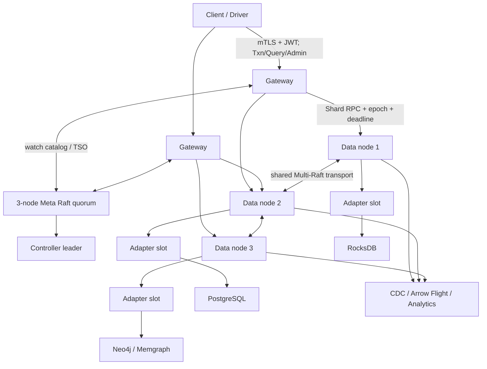
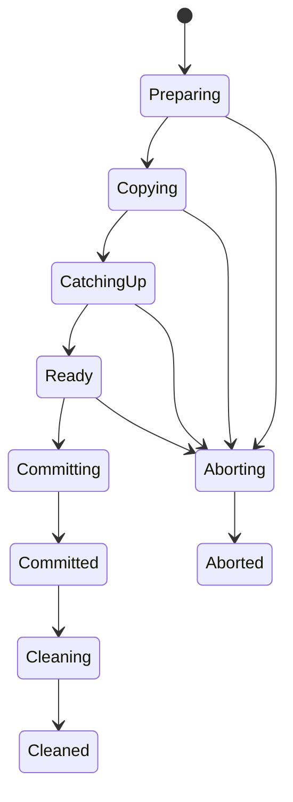

# DTGProxy 完整生产系统设计

日期：2026-07-18  
状态：已批准进入实施（用户授权系统自行选择推荐方案，无需逐项复批）  
基线：DTGProxy 1.0.0 研究原型，提交 `093c5aa`

## 1. 决策摘要

DTGProxy 的最终形态是一套 Rust 实现、计算存储分离、后端无关的分布式二时态图中间件。它把用户对时态图的读写、事务和查询翻译成可热插拔后端的普通持久化操作，同时在中间件层负责分片、复制、全局时间、跨分片事务、拓扑变更、流式查询、安全和运维。

本设计选择 **渐进式生产外壳（strangler + hexagonal core）**：保留 1.0 已经通过测试的二时态编码、事务状态机、Raft Shard、查询合并与 Adapter SPI，在其外部增加真正可独立部署的 Meta、Data、Gateway、Controller 进程和版本化 RPC。每替换一段进程内路径，都用同一套语义 TCK 证明新旧路径等价。

不选择以下方案：

1. **整体重写为异步微服务。** 接口会更整齐，但会同时重写最难的时态与事务正确性，回归风险最高。
2. **保留单进程内核，仅交给 Kubernetes 编排。** 编排器不能提供 Shard 共识、事务恢复和迁移原子性，无法消除当前原型边界。

第一承重子项目是“真实多进程集群运行时 + 持久化迁移状态机”。它完成前，安全、流式查询和运维都只能包裹一个单进程模拟集群，不能形成完整系统。

## 2. “完整”的可验证定义

“完整”不等于无限功能，也不等于支持完整 Cypher/GQL。它表示本设计承诺的范围内没有模拟路径、占位实现或只能人工恢复的正确性缺口。

| 能力域 | 完成门槛 |
|---|---|
| 部署 | 3 Meta、至少 3 Data、至少 2 Gateway 能作为独立 OS 进程跨主机运行；进程内集群仅保留为测试夹具 |
| 模式 | PrimaryReplica 是一个可复制 Shard；SharedNothing 是多个独立 Raft Shard；两者共享事务和查询协议 |
| 后端 | RocksDB、PostgreSQL、Neo4j/Memgraph 图协议均通过 Adapter TCK；进程内和 Sidecar 两种装载方式可按 Profile 热切换 |
| 时态语义 | 有效时间与系统时间均为半开区间；回溯修正、历史查询、diff、跨分片快照具有确定语义 |
| 一致性 | 默认 Temporal Snapshot Isolation；可选 Temporal Serializable；事务决定、参与者 intent 和恢复均持久化 |
| 拓扑 | 扩缩容、迁移、Leader 转移、节点 drain 是可重放状态机；任何单点崩溃不产生双归属或静默丢写 |
| 查询 | 分布式扫描/扩展以有界流执行，支持背压、取消、deadline、内存预算和必要时 spill |
| 安全 | 非 loopback 部署默认要求 mTLS；服务身份、JWT/OIDC、RBAC、tenant quota、审计均 fail closed |
| 运行 | readiness/liveness 分离；指标、追踪、结构化日志、备份/PITR、滚动升级、配置校验与灾难演练可操作 |
| 认证 | 故障注入、Jepsen 风格历史检查、模糊测试、外部后端版本矩阵、容量与尾延迟门槛进入 CI/发布门禁 |

保留的明确非目标：完整 Cypher/GQL 兼容、跨云强同步多活、透明转换任意后端专有存储格式、把 OLAP 全部塞入事务进程。查询语言通过稳定 Temporal IR 演进，OLAP 通过 Arrow/GRIN 接口解耦。

## 3. 可复用思想与代码边界

### 3.1 从主流系统吸收的设计思想

- **NebulaGraph：** Graph/Storage/Meta 分离；图操作在存储接口层下沉为 KV；每个 Partition 一个 Raft group；大量 group 共享传输与线程池。DTGProxy 采用同样的计算存储分离和 Multi-Raft 资源共享，但把本地引擎抽象为 Adapter，并把二时态语义置于共识命令之前。官方架构资料：[Storage Service](https://docs.nebula-graph.io/2.6.2/1.introduction/3.nebula-graph-architecture/4.storage-service/)、[Meta Service](https://docs.nebula-graph.io/3.6.0/1.introduction/3.nebula-graph-architecture/2.meta-service/)。
- **TigerGraph/Galaxybase：** 吸收分布式图系统将查询计划按分区下推、局部计算后归并，以及面向高扇出遍历控制通信放大的思想；不复制闭源实现。任何可复用源码只接受许可证兼容、边界清楚且能独立测试的模块。
- **图分析系统：** 事务在线路径产出版本化变更流，分析路径读取 Arrow RecordBatch/GraphAr 快照；避免 OLTP 与 BSP/列式扫描争抢同一执行器。
- **通用数据库中间件：** Gateway 无状态化、Meta 持久化权威元数据、数据面仅服从带 epoch 的租约/路由；把 rebalance 做成控制器 reconciliation，而非一次性管理脚本。

### 3.2 直接保留的 DTGProxy 资产

- `temporal-types`、`temporal-model`、`temporal-storage` 的规范化二时态模型与编码。
- `txn-protocol` 的 Home decision 和 Participant intent 状态机。
- `raft-command`、`raft-logstore`、`replica-snapshot`、`shard-runtime` 的确定性 Raft 状态机。
- `storage-api`、`adapter-registry` 和各后端 Adapter；外部插件继续通过 Sidecar 隔离。
- `temporal-ir` 与 `query-executor` 的语义层；执行方式由 materialize 演进为 stream。
- 所有现有 TCK、故障注入与随机化测试作为兼容门禁。

以下只作为测试夹具保留，生产路径必须替换：`InProcessShardGroup`、Gateway 内部创建全部 Replica、单线程 TCP request loop、三进程 Raft smoke binary。

### 3.3 第三方源码复用政策

首选成熟 Rust 基础设施而不是拷贝数据库实现：`raft-rs` 用于 Raft，`tonic`/`prost` 用于版本化 gRPC，`rustls` 提供 TLS，`tokio`/`tower` 提供并发与限流，Apache Arrow Rust/Flight 提供列式流。`tonic` 官方文档明确提供 HTTP/2、消息大小限制和 rustls TLS feature：[tonic 0.14](https://docs.rs/tonic/latest/tonic/)。Arrow Flight 转换工具由 Apache Arrow Rust 官方维护：[arrow_flight::utils](https://arrow.apache.org/rust/arrow_flight/utils/index.html)。

任何引入的源码必须：记录许可证和上游 commit；禁止复制 AGPL/商业闭源代码进入核心；通过薄适配层隔离；生成 SBOM；保留独立升级与替换能力。

## 4. 目标架构



### 4.1 进程职责

**Meta**

- 以独立 Raft group 持久化 Catalog revision、Schema、Backend Profile、节点注册、Shard placement、迁移任务、tenant/RBAC 元数据和 TSO lease。
- 只由 Leader 接受变更；Follower 提供 watch catch-up 与健康信息，不提供陈旧的权威路由。
- 命令具备 `command_id` 幂等性和 expected revision CAS；快照包含迁移与安全元数据。

**Data**

- 一个进程托管多个 Shard replica，所有 group 共享网络连接池、定时器、磁盘调度和工作线程。
- 每个 Replica 仍拥有独立 WAL、hard state、snapshot、Adapter slot 和 applied index。
- Shard RPC 校验 `cluster_id / graph_id / shard_id / placement_epoch / request_id / deadline`；旧 epoch 返回结构化重定向，不猜测新位置。
- 只有 Raft Leader 接受写；Follower 读必须带 closed timestamp/read proof。

**Gateway**

- 无状态、可水平扩展；watch Meta 并维护带 revision 的路由缓存。
- 提供事务协调、查询计划、流合并、认证/授权和 tenant admission control。
- 不持久化唯一事务决定；Home decision 落在事务 Home Shard。

**Controller**

- 通过 Meta Leader lease 保证单 active reconciler；可与 Meta 进程同部署，但逻辑上独立。
- 将声明式 placement 与实际 replica 状态收敛，驱动迁移、drain、备份、GC 和修复。
- 每个动作写回可重放状态，不依赖进程内 continuation。

### 4.2 RPC 分面

生产 RPC 使用 `tonic` gRPC/HTTP2，所有 protobuf package 以 `dtgproxy.<surface>.v1` 版本化。

| Service | 关键调用 |
|---|---|
| MetaService | GetCatalog, WatchCatalog, Propose, AllocateTimestamp, Heartbeat |
| ShardService | ExecuteCommand, Prepare, Decide, Read, Scan(stream), InstallSnapshot(stream), ReplicaStatus |
| GatewayService | Begin, Read, Mutate, Commit, Abort, Query(stream), Explain |
| AdminService | CreateGraph, AlterSchema, Rebalance, DrainNode, MigrateBackend, Backup, Restore |
| CdcService | Subscribe(stream), Ack |
| AnalyticsService | DoGet/DoExchange via Arrow Flight |

Raft 内部消息不与客户端 RPC 混用 service，但复用同一 mTLS 身份、连接池、流量类别和观测上下文。单帧和单流均有硬上限；大快照使用分块流、校验和与 resume token。

## 5. 数据、时间与事务不变量

1. 一个逻辑事实的可见性是 `valid_interval contains valid_at` 且 `system_interval contains system_at`；所有区间为 `[start, end)`。
2. 同一 Entity/Property 的系统时间链不可重叠；回溯修正只追加新系统版本并关闭旧版本。
3. Commit timestamp 由高可用 TSO 发放且严格大于事务观察到的最大时间；TSO lease 跨重启不回退。
4. 客户端成功只在 Home decision 已经 quorum committed 后返回；Participant apply 可以稍后由 recovery roll-forward。
5. 每个阶段使用稳定 `request_id / txn_id / phase_id`；网络重试、Leader 变化和 Gateway 重启不重复产生语义效果。
6. 事务记录捕获每个 Participant 的 placement epoch。恢复遇到 epoch 变化时先向 Meta 解析 `Shard lineage`，再把相同 phase 发送到新 Leader。
7. Temporal Serializable 在 TSI 冲突检查之上验证 read spans 与 predicate tokens；版本化 token 跟随 Shard 迁移。
8. 低水位以下且不受 retention/legal hold/backup pin 保护的历史才能压缩。

## 6. 两种部署模式

### 6.1 PrimaryReplica

- 一个图只有一个逻辑 Shard，通常 3 个 voter。
- 所有时态事务都在一个 Raft group 内完成，没有 2PC 网络扇出。
- 适合集中式图后端的高可用包装、较小图和低运维复杂度场景。
- 可通过在线 `SplitShard` 演进到 SharedNothing；split checkpoint 带一致 read timestamp，之后 dual-route/catch-up，再发布 topology epoch。

### 6.2 SharedNothing

- 图被映射为大量 virtual partition，再由稳定哈希映射到 Shard；物理扩容只移动 virtual partition ownership。
- 点和出边默认按源顶点共置；入边索引、跨分片边和热点顶点使用显式派生索引/edge cut 策略。
- 每个 Shard 独立 Raft；跨 Shard 使用 Home-based durable 2PC。
- 全局读由 Gateway 在固定 topology epoch 和 read timestamp 下扇出，并以有界 frontier 归并。

两种模式只改变路由和参与者数，不改变时态存储格式、Adapter SPI、事务 API 或查询结果。

## 7. 持久化拓扑迁移状态机

### 7.1 记录模型

Meta 为每个迁移持久化：

```text
MigrationRecord {
  migration_id, graph_id, shard_id,
  source_epoch, target_epoch,
  source_voters, target_voters,
  state, state_revision,
  snapshot_index, snapshot_checksum,
  catchup_index, cutover_index,
  owner_term, retry_count, last_error,
  created_at, updated_at
}
```

每次状态推进是带 `expected state_revision` 的 Catalog command。Data 端为 `(migration_id, step)` 持久化 receipt，因此 Controller 重放不会重复导入、加 peer 或删除数据。

### 7.2 状态与转换



- **Preparing：** 校验源 epoch、目标容量、后端能力和无冲突任务；在目标创建 learner 空壳。
- **Copying：** 从源 Leader 创建带 applied index 的逻辑/物理 checkpoint，分块传输并校验；不可一次性缓冲整个快照。
- **CatchingUp：** learner 从 checkpoint index 追 Raft/WAL 变更；源仍是唯一可写 placement。
- **Ready：** 目标 checksum、schema/backend generation、applied index 均满足 cutover fence。
- **Committing：** 通过 Raft joint consensus（一次只改变一个成员）或等价安全配置变更把目标转为 voter；发布唯一 `target_epoch`。该阶段失败只能重试，不能回滚到允许双 Leader 的旧状态。
- **Committed：** 新路由已权威生效；旧节点仅在 grace window 内返回 epoch redirect，不接受旧 epoch 写。
- **Cleaning：** 等待旧 epoch 活跃事务、备份 pin 和 CDC consumer fence 清空后删除旧 replica。
- **Aborting/Aborted：** 只允许在 topology 发布前进入；清理未发布 learner，不改变权威 placement。

### 7.3 崩溃不变量

- Catalog 中任意时刻只有一个 epoch 是写权威；目标未发布前不能接受客户端写。
- `Committing` 之后即使 Controller 崩溃，也从 Meta 记录与 Raft membership 实际状态收敛，不反向猜测。
- Snapshot receipt 只有在 fsync manifest、chunk checksums 和 Adapter restore 完成后落盘。
- topology 发布必须包含 lineage：`old_epoch -> new_epoch`，使事务 recovery 和旧 Gateway 得到确定重定向。
- 清理永不基于墙钟单独触发，必须同时满足低水位和引用计数条件。

### 7.4 后端热切换

后端切换复用同一 durable workflow，但源/目标是同一 Shard replica 上的两个 Adapter slot：`PrepareTarget -> Copy -> DualApply -> Verify -> PublishGeneration -> DrainSource -> Clean`。切换命令由 Raft 应用，Adapter generation 是每条请求和快照 manifest 的一部分。任何阶段重启后均由 receipt 继续；不允许先逐副本本地 cutover 再事后修改 Catalog。

## 8. 查询与分析执行

### 8.1 在线查询

- Parser 只产生稳定 Temporal IR；Planner 根据 Meta statistics、partition map 和 Adapter capabilities 生成 fragment DAG。
- 谓词、投影、时间范围、局部邻接扩展尽量下推；不能下推的 operator 在 Data/Gateway vectorized executor 执行。
- Shard 返回 `RecordBatch` stream，不返回整批 `Vec<Row>`。Gateway 用 bounded channel 和 k-way frontier 归并。
- 每个请求传播 deadline、cancellation token、tenant、memory/row/byte budget；所有 producer 在阻塞点检查取消。
- 超预算先 spill 到加密临时目录；不允许 spill 的请求返回稳定 resource-exhausted 状态。
- 热点超级节点支持 continuation token 和 fan-out 分页，避免一次扩展占满执行器。

### 8.2 CDC 与分析

- CDC 事件只来源于 committed Raft apply，键为 `(graph, shard, raft_index, ordinal)`，天然可重放。
- consumer checkpoint 持久化；retention 低水位考虑最慢受保护 consumer。
- Arrow Flight 暴露快照和变更批次；GRIN/GraphAr 作为离线分析互操作面。
- 分析任务运行在独立资源池，可读取固定 system timestamp 的快照，不持有在线事务锁。

## 9. 安全与多租户

- 所有服务身份使用 SPIFFE-like URI SAN；生产配置要求双向 TLS 1.3，证书与私钥仅通过文件/secret provider reference 加载。
- 客户端使用 OIDC/JWT；Gateway 验证 issuer、audience、signature、expiry 与 tenant binding。内部 RPC 传播已签名的短期 delegation context，Data 不信任普通 metadata header。
- RBAC 至少覆盖 cluster/tenant/graph/schema/query/mutate/admin/backup 权限；Meta 保存 policy revision，Gateway 缓存有短 TTL，失联时对新授权 fail closed。
- quota 在 Gateway admission 与 Data resource pool 双层执行，包含并发、QPS、写字节、扫描字节、内存、事务时长和 CDC lag。
- 审计日志记录主体、tenant、动作、资源、结果、request id、policy revision；敏感属性值、secret 和 token 永不写日志。
- loopback development profile 可显式关闭 TLS；绑定非 loopback 且未配置 mTLS 时启动失败。

## 10. 后台恢复、保留与备份

- Recovery sweeper 按 Shard 扫描过期 intent，查询 Home decision，确定 commit/abort；遇拓扑变化解析 lineage。
- Transaction GC 只在所有 participant receipt、CDC fence、backup pin 与低水位均越过 txn timestamp 后删除。
- 时间保留策略区分 system history、valid history、CDC 和 audit；legal hold 可覆盖默认 retention。
- Backup coordinator 在固定 Meta revision/TSO timestamp 下收集每个 Shard checkpoint 和 Catalog snapshot，生成校验 manifest。
- Restore 总是写入新 cluster/graph identity，校验完整性后原子发布；PITR 由 checkpoint 加 committed CDC/WAL replay 完成。
- 发布门禁包含定期 restore drill，而不仅是“备份命令成功”。

## 11. 可观测性与运行控制

- OpenTelemetry trace 串联 Gateway -> Meta/Shard -> Adapter；metrics 采用低基数标签，graph/tenant 高基数信息进入 trace/log。
- 必备指标：Raft term/commit/applied/lag、TSO lease、txn prepare/decision/recovery、intent age、migration state/bytes/lag、query queue/budget/spill/cancel、adapter latency/error/pool、CDC lag、GC watermark。
- liveness 仅表示进程 event loop 存活；readiness 还要求身份有效、Meta 可达、必要 Shard/Adapter 已恢复。
- graceful shutdown 先撤 readiness，再停止 admission，等待有界请求，转移 Leader/Controller lease，最后 flush WAL。
- 配置分 static/dynamic；未知字段、无效安全组合、重复 node id、目录共享等在启动前拒绝。
- 支持滚动升级的 wire/disk version 窗口；任何不可向后读的格式变更先做双读/双写迁移。

## 12. 交付分解与顺序

### P0：真实多进程集群与持久化迁移（当前）

1. 增加版本化 cluster protocol crate 与生成代码。
2. 提取 `ShardClient`，让事务/查询从进程内 group 解耦。
3. 实现独立 Data node：Multi-Raft host、Shard RPC、持久节点身份与 replica manifests。
4. 实现 3 节点 Meta quorum、Catalog watch 和 TSO lease。
5. Gateway 通过 Meta 路由并连接远程 Shard；进程内 runtime 只用于单元测试。
6. 实现上述 migration FSM、Controller reconciliation 和 crash matrix。
7. 通过 3 Meta + 3 Data + 2 Gateway 多进程故障验收。

### P1：事务生命周期与数据治理

后台 recovery、epoch lineage、intent/decision GC、CDC、低水位、retention、备份/PITR 与 restore drill。

### P2：流式查询与分析

并发 Gateway、streaming ShardClient、背压/取消/budget/spill、统计与下推、Arrow Flight/GRIN 输出。

### P3：安全、多租户与运维

mTLS、OIDC/JWT、RBAC、quota、audit、secret provider、OpenTelemetry、健康检查、graceful drain、升级工具。

### P4：生产认证

RocksDB/PostgreSQL/Neo4j/Memgraph 版本矩阵；网络分区、磁盘满、时钟异常、慢后端、进程/节点丢失；历史一致性检查、fuzz、SBOM、SLO/容量与恢复时间报告。

P0 到 P3 每一项完成后都保留可运行主干，不等待最后一次“大集成”。P4 通过后才能删除 `prototype` 限定并宣告生产边界；最终边界审核是最后一步。

## 13. P0 验收场景

自动化测试必须以真实子进程和真实 TCP 端口运行，不能通过共享内存观察状态：

1. 启动 3 Meta、3 Data、2 Gateway；从任意 Gateway 完成跨两个 Shard 的二时态事务，并从另一个 Gateway 在相同时间点读出。
2. 提交前杀死一个 Participant Leader，选举后重试只产生一个版本。
3. Home decision 提交后杀死 Gateway，sweeper 在新 placement 上 roll-forward。
4. 迁移在每个状态转换及 receipt fsync 前后注入崩溃；重启后最终只有一个写权威 epoch，查询无丢失/重复。
5. Meta Leader 失效后恢复；Catalog revision、TSO 与 migration state 单调。
6. 隔离旧 Gateway，使其持有旧路由；写请求得到 stale epoch 并刷新，不被旧节点接受。
7. Data 节点重启时从真实 RocksDB replica/WAL 恢复；PostgreSQL、Neo4j/Memgraph 跑相同逻辑 TCK。
8. 并发 migration 与 backend cutover 冲突时，Meta CAS 只允许一个 workflow 获得所有权。

## 14. 风险控制

- **异步化污染确定性内核：** RPC 层异步，状态机仍为同步纯 command/apply；用 channel boundary 隔离。
- **Meta 成为瓶颈：** 数据请求不经过 Meta；Gateway watch 增量 revision；TSO 使用持久 lease 批量分配。
- **外部后端无法复制物理状态：** Raft 复制逻辑时态命令，snapshot 使用 Adapter logical export/import；RocksDB 可增加受控物理快照 fast path，但不是正确性依赖。
- **跨分片遍历通信爆炸：** virtual partition 共置、局部扩展下推、frontier 去重/预算和 continuation token。
- **迁移与长事务互锁：** epoch lineage 保证恢复，低水位与最大事务时长保证旧 replica 最终可清理；管理员可显式终止超限事务。
- **插件破坏宿主稳定性：** 不可信/ABI 不匹配 Adapter 默认 Sidecar；in-process 仅允许内置或签名兼容插件。

## 15. 文档权威关系

本文件覆盖 `docs/dtgproxy-v1-boundary-audit.md` 中“下一版本顺序”的建议，但不抹去其历史审计事实。`2026-07-17-dtgproxy-design.md` 继续作为时态语义和长期能力背景；若部署/生产边界冲突，以本文件为准。每个子项目拥有独立实施计划和验收记录，最终审核以本节的完成门槛逐项取证。
