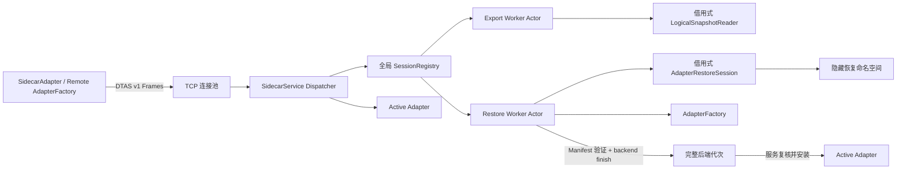

# Sidecar 可恢复逻辑快照会话设计

文档状态：已批准方案的书面评审稿
日期：2026-07-18
范围：Adapter Sidecar 远程逻辑导出、恢复与原子发布
决策：采用服务端全局、有界、可重连的会话注册表（方案 B）

## 1. 背景与问题

DTGProxy 已经在进程内 Storage Adapter SPI 中定义了规范逻辑快照：源 Adapter 在一致视图上按全局逻辑键序输出有界 Chunk，目标 Factory 在隐藏命名空间中恢复，校验完整 Manifest 后才发布。RocksDB 与 PostgreSQL 已实现这套进程内语义。

当前 Sidecar 线协议只支持 `Describe`、`Apply`、`MultiGet`、`Scan`、`AppliedLogIndex` 和 `Health`。这意味着 PostgreSQL 等进程外 Adapter 即使具备逻辑导出/恢复能力，也不能参与跨后端热迁移。简单地把导出 Reader 或恢复 Session 绑定到一条 TCP 连接，会在连接池切换、响应丢失或重连时丢失进度，还会把借用生命周期、阻塞数据库游标和 TCP Worker 耦合在一起。

本设计把一次逻辑导出或恢复建模为 Sidecar 服务级会话，而不是连接级会话。会话由不透明 ID 标识，保存在服务端有界注册表中，并由专用有界 Worker Actor 独占底层 Reader 或 Restore Session。客户端可在同一会话上重试、重连或切换连接，同时保持严格顺序、内容幂等和原子发布。

## 2. 目标

1. 让远程 Sidecar 完整实现 `StorageAdapter::begin_logical_export` 与 `AdapterFactory::begin_restore`。
2. 在 TCP 响应丢失、连接重建和连接池切换后无跳块、无重复落盘、无错误发布。
3. 不修改当前借用式 `LogicalSnapshotReader` 与 `AdapterRestoreSession` 的安全接口，也不引入 `unsafe` 或自引用对象。
4. 对会话数、线程数、命令排队、缓存、帧大小和生存时间设置硬上限。
5. 保持恢复目标在完整 Manifest 校验前不可见；未完成会话在失败、过期和进程关闭时均主动清理。
6. 让协议能力与实际 Sidecar Wire 能力一致，禁止把后端本地能力误报成远程可用能力。
7. 保持既有基础 Sidecar 请求的行为和合约测试不回退。

## 3. 非目标

- 本设计不定义 Neo4j/Memgraph 的数据映射与驱动实现。
- 本设计不实现双时态事务、2PC、TSO、Balancer 或跨 Shard 迁移编排。
- 本设计不让应用直接操作 Adapter 所有的后端命名空间。
- 本设计不把会话 ID 当作身份认证或授权凭证。
- 本设计不允许一个恢复会话在多台 Sidecar 进程之间漂移。进程在后端 `finish` 前崩溃时，上层从新会话重新传输；进程在后端发布后、`RestoreComplete` 返回前崩溃时，目标进入隔离待仲裁状态，不能自动重传或切换。
- 本设计不承诺未认证 TCP 可暴露到非可信网络；生产网络暴露仍要求 UDS 凭据或 mTLS。

## 4. 方案比较与决策

| 方案 | 重连语义 | Rust 生命周期 | 资源控制 | 决策 |
|---|---|---|---|---|
| A. TCP 连接绑定会话 | 断线即丢失；连接池不可透明切换 | 简单 | 连接关闭时自然回收 | 不采用 |
| B. 服务级有界会话注册表 | 会话跨连接存活，可按序重试 | Worker 栈内持有借用对象，无需自引用 | 显式配额、TTL、Reaper | 采用 |
| C. 后端持久化无状态令牌 | 可跨进程恢复 | 需要所有后端重做游标与恢复日志 | 后端状态复杂 | 不采用 |

方案 B 在不改变现有 SPI 的前提下提供所需故障语义。它不试图把会话做成跨进程持久协议；服务进程在后端发布前丢失时，上层以新 Snapshot ID 重新开始，未发布目标仍由 Adapter 的隐藏命名空间规则保护；发布后的不确定目标按隔离待仲裁规则处理。

## 5. 总体架构



### 5.1 `SidecarService`

`SidecarService` 取代 Dispatcher 直接持有单个 `&dyn StorageAdapter` 的方式，拥有：

- 可选的当前 `Arc<dyn StorageAdapter>`；
- 可选的 `Arc<dyn AdapterFactory>` 和拥有所有权的 `AdapterOpenRequest`，用于恢复目标模式；
- 全局 `SessionRegistry`；
- 服务状态与原子发布锁；
- Begin 请求重放缓存、会话 Reaper 和关闭令牌；
- Wire Feature、帧上限与配额配置。

基础读写 RPC 只读取当前 Active Adapter 的稳定快照。服务处于未发布状态时，基础 RPC 返回 `NOT_ACTIVE`，但 `Hello`、`Health` 和 `BeginRestore` 仍可使用。

### 5.2 `SessionRegistry`

注册表按 128 位随机 Session ID 索引会话句柄。句柄只保存会话类型、状态、命令发送端、最后活动时间、`in_flight` 标志和有限重放元数据，不保存借用式 Reader/Restore Session。实际借用对象只存在于对应 Worker 线程的栈内。

注册表操作在短临界区内完成；任何后端 I/O、Chunk 编解码和 Worker 等待都不得持有注册表锁。一次请求先查找会话并原子设置 `in_flight`，释放锁后再向容量为 1 的命令通道发送命令；同一会话已有命令执行时，新数据命令返回可重试的 `SESSION_BUSY`。Actor 返回后，Dispatcher 清除 `in_flight` 并刷新最后活动时间。客户端协议本身保持单请求顺序执行。

### 5.3 Worker Actor 与 Rust 生命周期

每个活动会话拥有一个专用阻塞 Worker：

- Export Worker 在线程栈上先持有 `Arc<dyn StorageAdapter>`，再从它创建借用式 `LogicalSnapshotReader`，随后循环处理 `Next`、`Abort` 和 `Shutdown`。
- Restore Worker 在线程栈上先持有 `Arc<dyn AdapterFactory>` 与拥有所有权的 Open Request，再创建借用式 `AdapterRestoreSession`，随后处理 `PushChunk`、`Finish`、`Abort` 和 `Shutdown`。
- 局部变量按逆序释放，确保 Reader/Session 先于 Adapter/Factory 销毁。
- TCP Worker 只做帧校验、Dispatcher 调用和有超时的 Actor 往返，不执行长时间数据库扫描或恢复。

该结构避免把借用自身成员的对象放入结构体，因而不需要自引用库、生命周期擦除或 `unsafe`。

## 6. 服务状态机

服务外部状态为：

```text
WaitingForRestore --BeginRestore--> Restoring
Restoring --Finish/验证/发布成功--> Active
Restoring --Abort/过期且清理成功--> WaitingForRestore
Active --BeginExport--> Active
```

另有内部终止状态 `Faulted`：恢复失败后若 Adapter 无法证明隐藏目标已清理，或发布后的 Adapter 描述/Applied Index 不满足已确认结果，服务进入 `Faulted`，拒绝所有数据 RPC，只保留 `Health` 与关闭操作。进程重启时，Factory 可自动回收明确未发布的 crash residue；若发现已经发布但没有 Sidecar 完成回执的目标，则继续隔离并要求迁移协调器或运维显式选择“验证后接管”或“退役后重建”，绝不自动暴露。

状态约束如下：

- `serve` 模式启动时必须成功打开并校验 Adapter，初始为 `Active`；它接受基础 RPC 和导出，但不接受恢复。
- `restore-target` 模式不提前创建或发布目标，初始为 `WaitingForRestore`，只允许一个恢复会话。
- `Restoring` 状态拒绝第二个不同的 `BeginRestore`；同一 Begin Request ID 返回原会话。
- 只有 Worker 的 `Finish` 已成功返回 Adapter，且服务复核 Descriptor 与 Applied Index 后，才能在发布锁内原子安装 Active Adapter。
- Active Adapter 一旦安装，在本进程生命周期内不被另一个恢复会话替换。

## 7. Wire 协议

### 7.1 帧与协商

固定 `DTAS` 帧头的 `WIRE_VERSION` 保持为 1。该协议尚未形成对外兼容承诺，因此在 v1 消息 Union 中增加会话消息，并用显式 `Hello` 协商功能。

服务端接受的编码后 Payload 硬上限从 16 MiB 调整为 20 MiB，即 `20 * 1024 * 1024` 字节。规范逻辑 Chunk 的未封装上限仍为 16 MiB；额外空间容纳 Protobuf 字段、键值条目元数据、摘要和帧内响应包装。Decoder 必须先验证声明长度不超过上限，再分配 Payload。

`HelloRequest` 包含：

- 客户端 Wire Version；
- 必需 Feature Bitset；
- 可选 Feature Bitset；
- 客户端可接受的最大 Payload。

`HelloResponse` 包含：

- 服务端 Wire Version；
- 已协商 Feature Bitset；
- 服务端最大 Payload；
- 逻辑 Chunk 最大字节数与最大条目数；
- 会话类型与协议格式版本。

首批 Feature Bit：

- `BASE_ADAPTER_V1`
- `LOGICAL_EXPORT_SESSION_V1`
- `LOGICAL_RESTORE_SESSION_V1`
- `RESUMABLE_ORDINAL_REPLAY_V1`

任一必需 Feature 未被协商时，客户端在发出数据请求前失败。`SidecarAdapter::describe` 返回的能力必须与 Wire Feature 取交集；例如后端本地声明 `logical_export=true`，但 Wire 未协商导出会话时，对远程调用方必须报告 `false`。

### 7.2 会话消息

```text
BeginExport {
  snapshot_limits,
  expected_applied_log_index?
}
ExportStarted {
  session_id,
  snapshot_header,
  negotiated_limits
}

ExportNext {
  session_id,
  expected_ordinal
}
ExportChunk {
  session_id,
  chunk
}
ExportComplete {
  session_id,
  manifest
}

BeginRestore {
  snapshot_header,
  target_open_request_public_fields
}
RestoreStarted {
  session_id,
  prospective_descriptor,
  negotiated_limits
}

RestoreChunk {
  session_id,
  chunk
}
RestoreChunkAccepted {
  session_id,
  ordinal,
  chunk_digest
}

FinishRestore {
  session_id,
  manifest
}
RestoreComplete {
  session_id,
  final_descriptor,
  applied_log_index
}

AbortSession {
  session_id
}
SessionAborted {
  session_id
}
```

`BeginExport` 与 `BeginRestore` 的去重 Request ID 来自固定 DTAS 帧头，不在 Protobuf Payload 中重复编码。

目标 Open Request 的 Secret 不通过 Wire 传输。数据库连接串和凭据由目标 Sidecar 的启动配置提供；BeginRestore 只携带已允许的公开目标参数，并由服务端与预配置 Profile 做严格匹配。

## 8. 请求去重与幂等语义

### 8.1 Begin 去重

固定帧中的 128 位 Request ID 继续用于响应关联。对 `BeginExport` 和 `BeginRestore`，它还用作服务端创建会话的去重键：

- 首次 Begin 原子地预留配额、创建 Worker，并缓存 `Started` 结果。
- 相同 Request ID 与相同规范请求摘要返回同一 Session ID 和同一结果。
- 相同 Request ID 携带不同请求摘要返回 `REQUEST_REPLAY_MISMATCH`。
- Begin 重放缓存最多 4096 项；记录至少与活动会话同寿命，并在会话结束后保留 300 秒。这样一个持续活跃超过 300 秒的会话也不会因迟到的 Begin 重试而被重复创建。
- Begin 创建过程失败时不缓存半成品；已启动 Worker 但响应生成失败时必须先中止并 Join Worker，再释放配额。

Chunk 不进入全局 Request-ID 响应缓存，避免缓存大 Payload。其重放由 Session ID、Ordinal 与 Digest 直接判定。

### 8.2 Export 幂等

Export Worker 保存 `next_ordinal`、最近一个已返回 Chunk 及完成 Manifest：

- `expected_ordinal == next_ordinal`：从 Reader 读取下一 Chunk。若有数据，缓存 Chunk 后把 `next_ordinal` 加一。
- `expected_ordinal + 1 == next_ordinal`：只在缓存中确有该 Ordinal 时返回完全相同的 Chunk，不推进 Reader。
- 其他回退或跳跃返回 Ordinal 错误。
- Reader 到达 EOF 时，Worker 立即调用 `finish` 生成 Manifest，缓存 `ExportComplete`，进入终态。
- 终态下，对 EOF Ordinal 的重复请求返回相同 Manifest；不再读取后端。

客户端只有在完整解码并验证 Chunk 的 Session ID、Ordinal 和 Digest 后才递增本地 Ordinal。TCP 响应丢失后，重试可命中最近 Chunk 缓存，不会跳过数据。

### 8.3 Restore 幂等

Restore Worker 保存 `next_ordinal`、最近已接受的 `(ordinal, digest)` 和终态结果：

- 收到 `ordinal == next_ordinal` 的 Chunk 时，先校验格式、Snapshot ID、边界与 Digest，再调用 Session 写入；成功后缓存 Ack 并递增。
- 收到最近已接受的相同 Ordinal 和相同 Digest 时，返回相同 Ack，不重复调用后端。
- 相同 Ordinal 但 Digest 不同，或出现 Ordinal 间隙，立即失败关闭该恢复会话并清理隐藏目标。
- `FinishRestore` 只有在 Manifest 的 Snapshot ID、Chunk 数、Entry 数、Applied Index 与流式聚合摘要全部一致时才调用底层 `finish`。
- 首次成功 Finish 后缓存 `RestoreComplete` 300 秒；响应丢失后的重复 Finish 必须返回完全相同的 Descriptor 与 Applied Index。
- 重复 Finish 携带不同 Manifest 返回 `TERMINAL_REPLAY_MISMATCH`。

底层 Restore Session 仍必须自身支持同 Chunk 的幂等写入；Wire 层缓存解决当前进程中的常见重放，后端幂等规则提供第二道保护。

## 9. 导出流程

1. 客户端完成 Hello，确认导出与 Ordinal Replay Feature。
2. 客户端调用远程 `SidecarAdapter::begin_logical_export`，固定一个 Request ID 重试 `BeginExport`。
3. 服务检查 Active 状态、能力、会话配额和可选 Applied Index Fence。
4. Export Worker 在自己的栈上打开一致 Reader，并返回 Snapshot Header；打开失败不注册会话。
5. 客户端 Reader 从 Ordinal 0 开始调用 `ExportNext`，逐块复核既有规范格式与 Digest。
6. EOF 返回 `ExportComplete`；客户端复核 Manifest 后结束 Reader。
7. 客户端 Drop 未完成 Reader 时尽力发送 `AbortSession`；网络不可用时由 Idle TTL 回收。

远程 `LogicalSnapshotReader` 拥有 `Arc<dyn SidecarTransport>`、Session ID、Header、下一个 Ordinal 和完成状态。它满足 SPI 的借用返回类型，但不借用服务器资源的本地内存表示。

## 10. 恢复与发布流程

1. Registry 从源 Reader 获得 Header 后，调用远程 `SidecarAdapterFactory::begin_restore`。
2. 目标服务在 `WaitingForRestore` 下校验公开 Open Request、Header、配额与 Feature。
3. Restore Worker 创建隐藏命名空间和借用式 Restore Session，再返回稳定的 Prospective Descriptor。
4. 客户端 Registry 在发送任何 Chunk 前按选定 Requirement 校验该 Descriptor。
5. 客户端从 Ordinal 0 顺序发送 Chunk；每个 Ack 必须匹配 Ordinal 和 Digest。
6. 客户端发送 Manifest；Worker 完成全流校验并调用底层 `finish`。
7. Worker 返回已由后端 `finish` 完成 Manifest 原子发布、但尚未对 Sidecar 数据 RPC 可见的目标 Adapter。服务验证最终 Descriptor、`applied_log_index == manifest.applied_log_index` 和目标健康状态。
8. 服务在发布锁内确认仍为同一 Restore Session，然后原子安装 Active Adapter 并切换为 `Active`。
9. `RestoreComplete` 只有在安装成功后返回；随后基础读写与导出 RPC 才可见目标。

这里区分两层可见性：Adapter `finish` 负责后端命名空间在完整 Manifest 后的原子发布，Sidecar 安装负责对中间件 RPC 的原子可见。`finish` 之前的 Chunk、Manifest 或后端错误必须清理隐藏目标，清理成功后回到 `WaitingForRestore`；`finish` 之后若最终复核、Sidecar 安装或进程存活失败，完整后端代次可能已发布，但不得对 Sidecar 数据 RPC 可见，服务必须进入隔离待仲裁状态。源端在收到并持久化 `RestoreComplete` 前不得进入 Dual Apply 或 Cutover，因此这个故障窗口降低可用性但不会切换到不确定目标。

## 11. 资源边界与生命周期

默认值和硬边界如下：

| 资源 | 默认值 | 硬边界/行为 |
|---|---:|---|
| 活动 Export 会话 | 32 | 配置不得超过 64 |
| 活动 Restore 会话 | 1 | 当前单目标服务固定为 1 |
| 活动会话总数 | 33 | 当前模型不得超过 65 |
| 每会话 Actor 命令队列 | 1 | 固定有界，不可配置为无界 |
| 会话 Idle TTL | 300 秒 | 请求准入及完成时刷新，`in_flight` 时不回收 |
| 完成结果保留 | 300 秒 | 到期后返回 `SESSION_EXPIRED` |
| Begin 重放缓存 | 4096 项 | 活动期保留，结束后 TTL 300 秒 |
| 过期 Session Tombstone | 4096 项 | TTL 300 秒，只保存 ID 哈希、Kind 与过期时间 |
| 规范 Chunk | 16 MiB / 65,536 entries | 沿用 Storage API 上限 |
| DTAS Payload | 20 MiB | 解码分配前检查 |

Reaper 每 5 秒扫描一次到期会话。Idle 只计算没有 `in_flight` 命令的时间，后端正在执行一个合法请求时不会被误判过期。Reaper 发送 Abort/Shutdown 后，在不持有注册表锁时等待 Worker 的退出确认；收到确认后才 Join。若 30 秒内没有退出确认，服务健康状态变为 Faulted 并拒绝新会话，进程 Supervisor 负责终止并重启该 Sidecar，避免在无超时能力的线程 Join 上永久阻塞。

过期会话从活动表移除后写入有界 Tombstone Cache，使迟到请求在 300 秒内得到 `SESSION_EXPIRED`；Tombstone 到期或因容量淘汰后统一返回 `SESSION_UNKNOWN`。Tombstone 不保存 Session Secret、Chunk 或后端信息。

服务关闭按以下顺序执行：停止接受新连接，拒绝新 Begin，向所有会话发 Shutdown，中断活动 TCP 连接，Join Worker，最后释放 Adapter/Factory。退出不等待 Idle TTL。

## 12. 错误模型

结构化错误包含稳定 Code、是否可重试和经过脱敏的消息。首批新增 Code：

- `FEATURE_UNSUPPORTED`
- `NOT_ACTIVE`
- `RESOURCE_EXHAUSTED`
- `SESSION_UNKNOWN`
- `SESSION_EXPIRED`
- `SESSION_KIND_MISMATCH`
- `SESSION_BUSY`
- `ORDINAL_GAP`
- `ORDINAL_REGRESSION`
- `CHUNK_DIGEST_MISMATCH`
- `REQUEST_REPLAY_MISMATCH`
- `TERMINAL_REPLAY_MISMATCH`
- `RESTORE_ALREADY_IN_PROGRESS`
- `SERVICE_FAULTED`

`RESOURCE_EXHAUSTED`、连接中断和请求超时可在保留原 Request ID/Session ID 的前提下重试。Digest、Ordinal 内容冲突、终态冲突和 Faulted 不可自动重试。错误消息不得包含数据库 URL、凭据、完整 Session Registry、后端 SQL 或任意 Secret 参数。

## 13. PostgreSQL Sidecar 运行模式

二进制提供互斥模式：

- `serve`：读取现有环境配置，启动时打开已发布实例，校验后进入 Active。
- `restore-target`：读取 Factory、数据库凭据与目标 Open Request，但不打开或发布目标；服务从 WaitingForRestore 启动。

`restore-target` 不接受客户端提供连接串或实例 Secret。成功 Finish 后由同一服务进程托管刚恢复的 Active Adapter，因此客户端得到的远程 Adapter 可立即继续接收后续 Raft Apply。

## 14. 安全边界

- 未认证 TCP 监听地址继续强制为 Loopback。
- Session ID 使用操作系统 CSPRNG 生成的 128 位值，只解决碰撞和不可预测误操作，不构成授权。
- Request ID 与 Session ID 均不得进入默认 Info 日志；Trace 日志只记录截断哈希。
- 公开 Open Request 采用字段白名单，Secret 只由 Sidecar 本地配置注入。
- mTLS/UDS 身份接入后，会话必须绑定经过认证的调用方身份，跨身份访问返回统一的 Unknown Session，避免枚举。

## 15. 性能与可观测性

性能原则：

- 后端阻塞扫描和恢复写入运行在会话 Actor，不占用 TCP 接入 Worker 或 Raft Apply Worker。
- 每个 Export 会话最多缓存一个 16 MiB Chunk；全局不缓存 Chunk 响应。
- Restore 会话只缓存最近 Ack、流式摘要状态和小型终态结果。
- TCP 连接池继续使用固定连接数和原 Request ID 的一次重连重试；会话协议不依赖选中同一连接。
- 所有队列和缓存暴露占用率，高水位可在耗尽前触发限流。

必须暴露以下指标：活动/到期/中止会话数、会话创建拒绝数、Chunk 字节与耗时、Ordinal 重放数、Digest 失败数、Begin 重放命中数、Worker 队列等待、发布成功/失败数、Reaper 清理耗时和 Worker Join 超时数。指标标签不得使用原始 Session ID、Request ID、实例 ID 或用户键。

## 16. 兼容性与升级

- 既有基础消息继续在 `WIRE_VERSION=1` 下编码，旧客户端未请求新 Feature 时可继续使用基础 RPC。
- 新客户端必须先 Hello；服务端不支持必需 Feature 时在开始迁移前失败。
- Descriptor 的快照能力以“后端能力 ∩ Wire 能力”为准，防止规划器选择不可远程执行的路径。
- 会话只在单个 Sidecar 进程生命周期内有效；滚动升级前 Supervisor 必须先停止接收新会话并等待或中止现有会话。
- Snapshot Format Version 仍由 Storage API 规范控制，不能用 Wire Version 替代。

## 17. 测试策略

### 17.1 协议与单元测试

- 所有新增 Protobuf Variant 的规范编码/解码往返。
- 未知 Variant、非法 Enum、非规范编码、CRC 错误、长度不符与超过 20 MiB 的帧均失败关闭。
- Hello 必需 Feature 缺失、最大 Payload 不兼容和 Descriptor 能力取交集。
- Session ID/Kind、Ordinal、Digest、Begin Request 摘要和终态 Manifest 的状态机测试。

### 17.2 Loopback 合约测试

- Memory/RocksDB 经 Sidecar 完成导出和恢复，逐 Keyspace、Key、Value 与 Applied Index 相等。
- 远程 Adapter Factory 的 Prospective Descriptor 在首块写入前通过 Registry Capability Gate。
- Drop 未完成 Reader/Restore Session 会 Abort，目标不发布。
- 既有 Describe/Apply/MultiGet/Scan/AppliedLogIndex/Health 合约保持通过。

### 17.3 TCP 故障测试

- Export Chunk 在服务执行后丢失响应；客户端换连接重试，得到相同 Chunk 且不跳块。
- Begin 响应丢失；相同 Request ID 不创建第二个 Worker。
- Restore Ack 丢失；相同 Chunk 返回相同 Ack 且底层只推进一次。
- 同 Ordinal 不同 Digest 失败并保持目标不可见。
- Finish 响应丢失；重复 Finish 返回相同 RestoreComplete。
- 连接断开、超时和连接池切换均不改变 Session 进度。
- 进程在 `finish` 前崩溃时隐藏目标可回收；在后端发布后、回执前崩溃时目标被隔离，源端不进入 Dual Apply/Cutover。

### 17.4 资源与生命周期测试

- 达到 Export、Restore、总会话和 Begin Cache 上限后稳定返回 Resource Exhausted。
- Actor 命令队列保持有界，慢后端不会导致无限排队或线程增长。
- Reaper 在无新请求时也能主动中止过期会话并释放许可。
- 完成结果在 300 秒窗口内可重放，过期后返回 Session Expired。
- 服务关闭中止并 Join 所有 Actor；清理失败进入 Faulted。

### 17.5 后端与跨后端测试

- PostgreSQL `serve` 与 `restore-target` 两种模式的实时测试。
- RocksDB → PostgreSQL 和 PostgreSQL → RocksDB 经真实 TCP Sidecar 的字节保持迁移。
- 坏 Chunk、坏 Manifest、错误 Applied Index、能力不匹配和 PostgreSQL 进程重启均不得暴露半恢复目标。
- 需要外部 PostgreSQL 的测试以 `#[ignore]` 保留，并在可用的临时数据库 CI Job 中作为发布门禁运行。

## 18. 验收标准

实现只有同时满足以下条件才可宣告远程逻辑迁移完成：

1. `SidecarAdapter` 可作为源通过 Registry 完成规范逻辑导出。
2. `SidecarAdapterFactory` 可作为目标通过 Registry 完成隐藏恢复、Manifest 校验与原子发布。
3. 响应丢失与跨连接重试测试证明无跳块、无内容分叉、无重复发布。
4. 会话、线程、队列、缓存、帧和 TTL 全部有可执行硬上限与耗尽测试。
5. `finish` 前任何恢复失败都证明后端目标未发布；`finish` 后若 Sidecar 安装失败，服务保持不可见并进入 Faulted。
6. Wire Feature 与 Descriptor 能力一致，旧基础 RPC 不回退。
7. 单元、合约、TCP 故障、RocksDB 集成测试、格式检查和严格 Clippy 全部通过。
8. PostgreSQL 临时实例上的实时与跨后端测试通过后，才把 PostgreSQL 远程迁移状态从“待认证”改为“已认证”。

## 19. 代码边界

实现应集中在以下边界，避免把 Wire 细节泄漏到时态内核：

- `storage-api`：保持现有 Snapshot Header/Chunk/Manifest 与借用式 Trait，不因 Sidecar 修改核心格式。
- `adapter-sidecar/proto`：新增 Hello、会话请求/响应和错误码。
- `adapter-sidecar`：实现 `SidecarService`、Session Registry、Actor、远程 Reader/Factory/Restore Session 与 TCP 故障语义。
- `adapter-registry`：继续负责 Capability Gate 与端到端流驱动，不感知 TCP Session 内部状态。
- `adapter-postgres`：Sidecar 二进制增加两种运行模式，Factory 与 Restore Session 的进程内正确性逻辑保持唯一实现。

该边界使其他 SQL/图后端只需实现 Storage Adapter/Factory 语义，即可复用同一套有界、可恢复的 Sidecar 会话协议。
